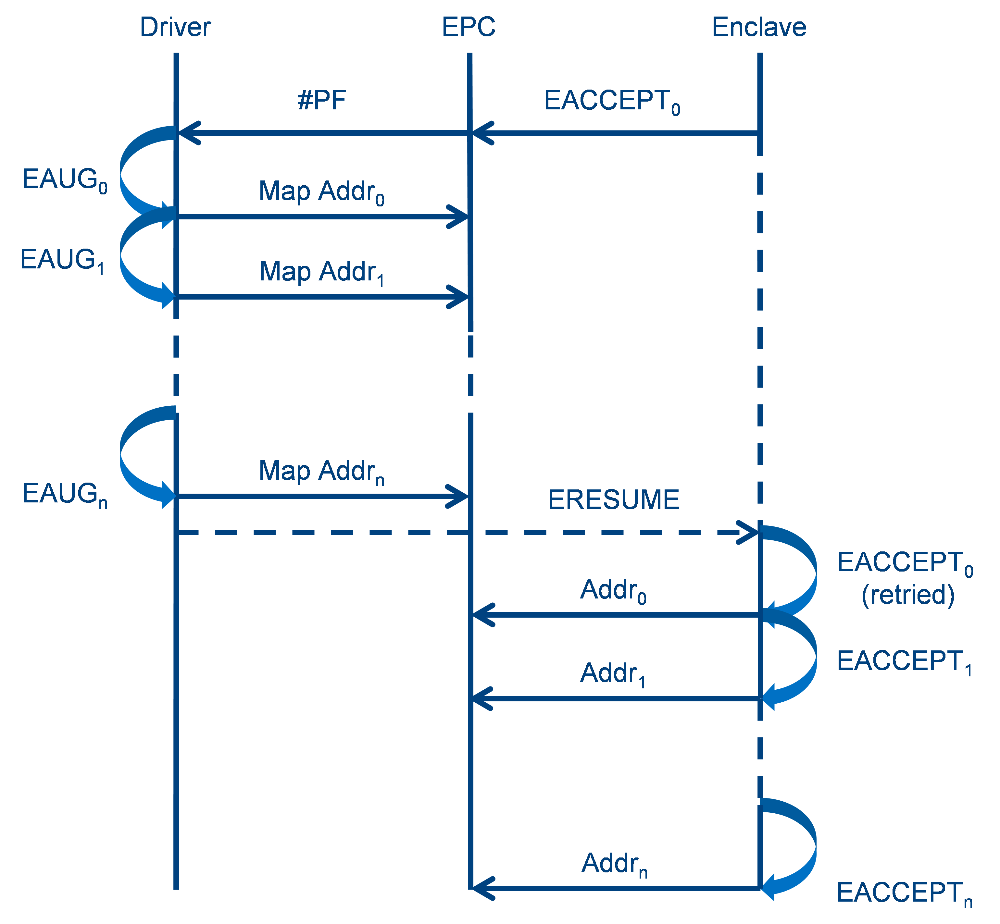
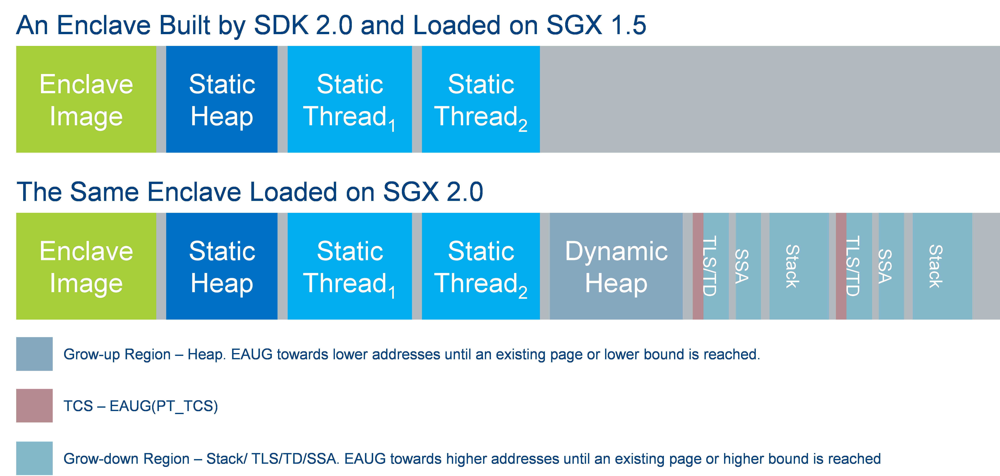
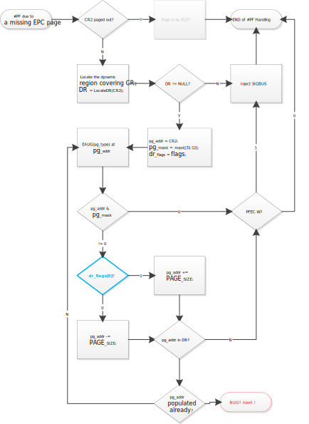
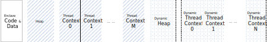
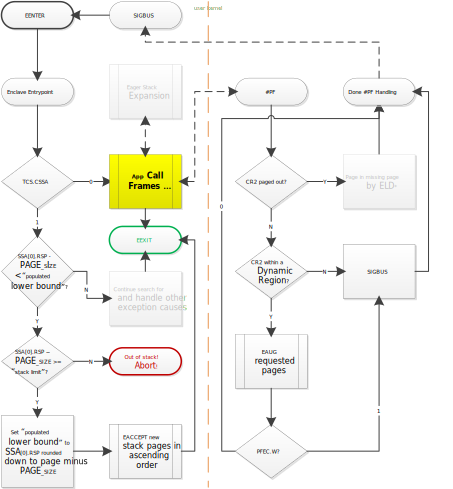
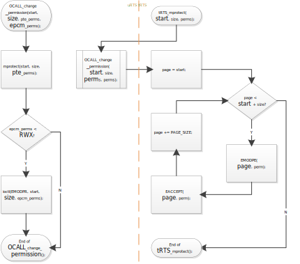
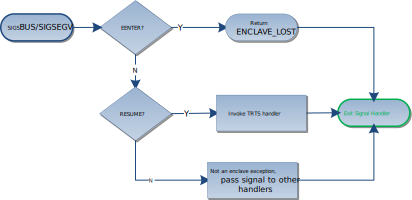
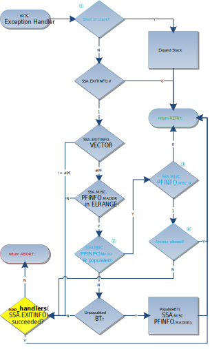

SGX2.0 EDMM High Level Design
==================================

# Introduction

## Purpose of this Document

This document outlines possible software architecture changes and
enhancements required in the existing SGX1.0/1.5 platform software and
potentially to operating systems such as Linux/Android and Windows, to
support and take advantage of EDMM (Enclave Dynamic Memory Management)
feature of the SGX 2.0 instruction set.  

After reading this document, one will be able to understand the
architectural design used in the EDMM enabled SGX software stack and why
these architecture changes were selected.

## Acronyms

**EDMM**: Enclave Dynamic Memory Management.

**EPC**: Enclave Page Cache

**RTS**: SGX Run Time System, software convention and libraries that
compliment SGX hardware

**tRTS**: Trusted run time system

**uRTS**: Untrusted runtime system

**PSW**: Platform Software

**SDM**: Intel Software Developer Manual, refer to the latest in this context.
**SECS**: Secure Enclave Control structure

**TCS**: Thread control structure

# <span id="anchor-55"></span>Theory of Operation

This section describes how EDMM features are used by the SGX 2.0 SDK.

EDMM adds to SGX architecture dynamic capabilities, which can be divided
into 2 groups – Dynamic Page Allocation/Deallocation and Dynamic Page
Attributes, each of which is described in a dedicated subsection. As we are proposing a page fault based allocation, handling SGX exceptions is discussed in the last subsection.

## <span id="anchor-59"></span>Dynamic Page Allocation/Deallocation

EDMM introduces an instruction – EAUG to add EPC pages to an existing
enclave after EINIT. All pages added by EAUG are required to be accepted
by the enclave explicitly using EACCEPT as a security measure. More
details are available in the SDM.

Another new instruction introduced by EDMM is EMODT, which modifies the
type of a page. A new page type PT\_TRIM has also been introduced. A
PT\_TRIM page is unusable except being removed by EREMOVE. The purpose
of PT\_TRIM is to give the enclave a confirmation of deallocation of a
given page, so that it’ll be secure to accept a new page later at the
same virtual address again. More details are available in the SDM.

### <span id="anchor-64"></span>Dynamic Page Allocation

It is a better use of EPC pages to expand/shrink heap/stacks dynamically
at runtime, than to prepopulate the whole heap/stacks at enclave load
time. SGX has introduced 2 EDMM instructions for allocating EPC pages
for an enclave at runtime – EAUG and EACCEPT. EAUG is a privileged
instruction for adding an EPC page to an initialized enclave, while
EACCEPT is an enclave instruction for an enclave to accept a newly added
page. It is provided as a facility to enable an enclave to disallow 2 or
more different EPC pages to be mapped at the same linear address, in
order to prevent the replay attack that 2 versions of the same page are
kept in 2 physical EPC pages and allowed to be switched back and forth
by an adversary. \#PF will result from accesses to EAUG’ed but not
EACCEPT’ed pages. See the SDM for more information on attacks as well as
SGX facilities to defeat them.

Because of the EAUG/EACCEPT protocol, dynamic page allocation is a
collaborative task between the requesting enclave and privileged
software that manages EPC and is responsible for allocating and mapping
EPC pages into any given enclaves.

1.  When more pages are needed, the enclave informs privileged software
    somehow the number of pages needed and the virtual address range
    they should be mapped into.
2.  Privileged software responds by allocating EPC pages and mapping
    them to specified addresses followed by EAUGs to add them to the
    requesting enclave.
3.  The enclave accepts those newly added pages by EACCEPTs.

Step \#2 and \#3 are straight forward, while a typical thought for step
\#1 is to have the enclave OCALL into uRTS with the address/size
information, which will be passed on to privileged software via system
calls. While this approach will work, it has the overhead of OCALLs
which requires involvement of uRTS and degrades performance. A better
approach is described below which doesn’t involve uRTS.

#### \#PF Based Page Allocation Request

As discussed earlier, no more than 1 (one) EPC page is allowed at any
given linear address within ELRANGE as a security measurement. SGX has
provided a facility to make sure any EPC page can be mapped at its
“desired address” only (i.e. an EPC page can only be mapped to the
linear address specified in its EPCM entry, see SDM for more
details), but it remains as a responsibility of the enclave to make sure
no 2 EPC pages would have the same “desired address”. In general, an
enclave shall be able to distinguish populated addresses versus
unpopulated ones and issue EACCEPTs on unpopulated addresses only.

**NOTE:** Unpopulated address is the address of the page that has not
yet been added into the enclave dynamically. Populated address is
vice-versa.

\#PF based allocation is an exploit on the fact that an enclave will
issue EACCEPTs on unpopulated addresses only. It could be as simple as
described below.

1.  When a page is needed, the enclave issues an EACCEPT at the
    (unpopulated) address it’d like the page to map to.
2.  \#PF results from EACCEPT in step \#1. Privileged software responds
    by allocating an EPC page and mapping it to the faulting address
    followed by an EAUG.
3.  After \#PF handler returns, the enclave is resumed, and the EACCEPT
    is retried and succeeds. The newly allocated page is ready for use
    from now on.

This approach doesn’t require any intervention by uRTS, but is slow when
a large range is requested because every EACCEPT issued by the enclave
will result in a \#PF. An ideal algorithm should be able to
allocate/map/EAUG all requested pages in just a single \#PF (triggered
by the 1<sup>st</sup> EACCEPT) and allow the rest of EACCEPTs to succeed
right away. That leads to “Dynamic Regions” as described in the
following section.

**NOTE:** Privileged software is required to understand the enclave
memory layout (expressed in the form of “Dynamic Region”) to some
extent, which however doesn’t constitute dependencies between the tRTS
and the privileged software. In other words, privileged software assumes
an enclave to request memory in a “certain” way (as conveyed via
“Dynamic Regions”), which if not followed by an enclave, would lead to
subpar performance or crash of the enclave, but otherwise wouldn’t break
the privileged software anyhow.

#### Dynamic Regions

**Note:** This part is not yet implemented.
 
The idea of an ideal page allocation protocol/flow is depicted in
[the figure \#PF Based Page Allocation](#anchor-69) below. In the
process of allocating *n* pages, the 1<sup>st</sup> EACCEPT (i.e.
EACCEPT<sub>0</sub>) triggers a \#PF, privileged software responses by
EAUG’ing all *n* pages, then the enclave is resumed and the whole
sequence of EACCEPTs succeed right away.

In order to make the flow above work, the privileged software must be
aware of 

  - The ranges within which the enclave could request for new pages.
    This is to distinguish page allocation requests from buggy accesses.
  - The number of pages requested by the enclave so that all pages could
    be prepopulated before the rest of EACCEPTs.
  - The types and/or attributes of the requested pages, because EAUG may
    allow a page type to be specified, and it may be desired to keep PTE
    attributes synchronized with EPCM attributes.

All the requirements above lead to the definition of “Dynamic Regions”
depicted in the pseudo code below.
```
struct isgx_dynamic_range {  
	struct isgx_range range;  	// Range  
	unsigned int     flags;  	// Grow up or down region  
	unsigned int     mask;   	// Address mask  
};

struct isgx_range {  
	unsigned long start_addr; 	// Start address  
	unsigned int nr_pages;    	// Number of pages in range
};
```
<span class="image" id="anchor-69"></span>
||
|:-:|
|*\#PF Based Page Allocation*|

A dynamic region is a range of virtual address space within which a \#PF
would be considered a page allocation request instead of a software bug.
Privileged software associates a list of dynamic regions to every loaded
enclave. The list is initially empty when an enclave is created, and
could be changed via system calls (or IOCTLs if EPC is managed by a
driver). uRTS typically creates an initial list of dynamic regions based
on metadata before entering an enclave for the 1<sup>st</sup> time. An
enclave may redefine the list of regions if deemed necessary. See TBD
for tRTS APIs to redefine dynamic regions at runtime.

**NOTE: **Page attributes are NOT specified in region definitions for
now because RW is the only page attribute used by SGX SDK. Given that
EACCEPT may be able to change page attributes directly in future, page
attributes may never need to be known by privileged software.

*start\_addr* data member defines the start address of the region. Bits
0-11 should be all zeroes since value should be page aligned.

*nr\_pages* data member defines the size of the range in 4K pages.

*range* data member defines the dynamic memory region boundary.

*flags* data member defines either a grow up region or a grow down
region. A value of ‘0’ indicates that it is growing up region and a
value of ‘1’ indicates it is a growing down region.

*mask* data member defines the growing “magnitude” of the region. The
mask value must have bits 0-11 all zeroed, higher bits will be ‘1’ or
‘0’ according to the number of pages we want to augment for each
page fault. The mask is AND’ed with bits 31:12 of the address of the
last EAUG’ed page, and if the result is 0 (zero), privileged software
shall stop EAUGing more pages. This mask is mainly used to populate
discrete memory blocks of same alignment for dynamic code loading.

A grow-up region (*flags* is 1) is a region in which new pages are
typically populated from the lower bound of the region, such as a heap.
When a \#PF occurred within a grow-up region, privileged software would
assume it was the start of a slew of page requests which would
eventually fill the gap (if any) between the faulting address and the
closest page populated at a lower address. As a result, privileged
software would populate the faulting page (denoted as *P*<sub>*n*</sub>,
where *n* is the page frame number), as well as all lower addresses in
descending order (i.e. *P*<sub>*n-1*</sub>, *P*<sub>*n-2*</sub>, …),
until any one of the following is true. 

  - An existing page is reached. That is, the gap between the closest
    populated page at a lower address and the faulting address has been
    closed.
  - The lower bound of the region is reached. That is, the range between
    the lower bound of the current region and the faulting address has
    been fully populated.
  - The result of ANDing bits 31:12 of the address of the last EAUG’ed
    page with *mask* *\[31:12\]* is 0 (zero). 

Similarly, a grow-down region (*flags* is 1) is a region in which pages
are assumed to be requested from its higher bound. In response to a
\#PF, Privileged software populates the faulting address (say
*P*<sub>*n*</sub>), as well as all higher addresses in ascending order
(i.e. *P*<sub>*n+1*</sub>, *P*<sub>*n+2*</sub>, …), until either an
existing page of the higher bound of the region is reached, or a page
whose address AND’ed with *mask* *\[31:12\]* produces 0 (zero) has been
EAUG’ed.

In order to make good use of dynamic regions, tRTS has to EACCEPT pages
in “optimal” orders.

  - A heap is typically implemented as a grow-up region. When more than
    1 (one) pages are being requested, tRTS should EACCEPT the pages in
    descending order (i.e. EACCEPT the one at the highest address
    first).
  - A stack is typically implemented as a grow-down region. When more
    than 1 (one) pages are being requested, tRTS should EACCEPT the
    pages in ascending order (i.e. EACCEPT the one at the lowest address
    first.

**NOTE:** An erroneous access that hits a dynamic region accidentally
will cause an EPC page to be populated at the address of \#PF, because
there’s no way for privileged software to tell erroneous accesses from
legitimate page requests. As tRTS will not EACCEPT the newly EAUG’ed
page (hopefully), an erroneous W access typically ends up in SIGBUS (see
\#PF handling flow in below) that the enclave cannot handle, while an
R/X access results in a SIGSEGV (because of R/X on a pending EPC page).

#### Exception/Signal Injection

Discussions earlier on dynamic regions were focused on the assumption
that \#PF was triggered by an EACCEPT instruction, which isn’t always
true in practice. For example, function call frames may eventually reach
an under-populated stack (assumed covered by a grow-down region) and
cause a \#PF by a PUSH instruction, in which case the newly EAUG’ed page
can’t be used simply because it hasn’t been accepted and the faulting
instruction isn’t an EACCEPT. Hence, an exception (signal in Linux) is
necessary to get the enclave into an error handling path to EACCEPT the
newly EAUG’ed page before its normal execution path could continue.

But how is privileged software able to tell whether an exception/signal
should be injected? The ideal solution is to have an exception/signal
injected only if the faulting instruction is NOT an EACCEPT, which isn’t
possible unfortunately because privileged software is prohibited from
peeking into the interrupted (or in fact, any) enclave’s memory/context
to figure out what the faulting instruction is. Fortunately, a
suboptimal and simple algorithm exists to achieve nearly the ideal
result, and could be described as: *Inject an exception/signal if and
only if \#PF was caused by a W (Write) attempt to a missing page.*

To see how/why that works, keep the following in mind.

  - A non-existing page is considered “uninitialized”, so are the data
    objects contained in it.  
    **NOTE:** EAUG’ed pages are filled with 0s (zeroes) and could be
    considered as “initialized”. That doesn’t matter in practice
    however, because enclaves will be aware of the allocation request
    and issue EACCEPTs before accessing the new pages in any other ways.
    The only exception is in stack expansion, where the enclave is
    unaware of the page allocation. But neither enclave code nor the
    compiler would assume certain values in a stack page in any cases.
  - Properly written software shall never read uninitialized data
    objects. That is, the first access to a non-existing page shall
    always be a W (Write) to initialize some data objects on that
    non-existing page, or it’d be a bug otherwise.
  - EACCEPT accesses a page as an R (Read), which distinguishes it from
    all other (non-buggy or write) instructions that initialize any data
    objects on that page.
  - In the case of a buggy enclave, the faulting R will trigger \#PF
    again after resuming from EAUG, and privileged software will notice
    \#PF on a populated page implying EPCM attributes are violated (EPCM
    induced \#PF), and will take actions accordingly. For example,
    SIGSEGV will be sent to the application on Linux. That is, it is
    safe to consider an R access as an EACCEPT even if it isn’t.

### <span id="anchor-73"></span>Dynamic Page Deallocation

EDMM has introduced a new page type PT\_TRIM to support secure
deallocation of unused EPC pages from an enclave.

**NOTE:** EMODT instruction sets a valid EPC page to the specified type,
and sets in its EPCM the MODIFIED bit, which remains set until the
enclave executes EACCEPT. A regular or TCS page can be converted to
PT\_TRIM type using EMODT. Any EPC page could be EREMOVE’d without being
EMODT’ed at any time by privileged software. However, EMODT(PT\_TRIM)
ensures the owner enclave that the page requested will never be
accessible again until it is EREMOVE’d, therefore it’d be secure for the
enclave to accept a new page at the same linear address again at a later
time.

Given that privileged software will never know which pages aren’t needed
anymore by any enclaves, the page deallocation flow must be initiated by
the owner enclave and done with following sequences.

1.  Enclave determines the range of pages to free (deallocate), and makes an
    OCALL to uRTS with address/size information, which is then passed on
    to privileged software via system calls (or an IOCTL in the case of
    a driver).
2.  Privileged software EMODTs those pages in range to type PT\_TRIM. 
3.  The enclave EACCEPTs the page type change for those pages in range. 
4.  After the pages have been EACCEPTed successfully, the enclave makes
    another OCALL to notify the privileged software that these pages can
    be removed via system calls (or an IOCTL in the case of a driver). 
5.  Privileged software executes EREMOVE for the range of pages notified
    by the enclave.

See later section on heap deallocation for a more detailed description
of page removal flow.

### <span id="anchor-80"></span>Compatibility with Older SGX Architectures

Dynamic Page Allocation/Deallocation is a system-friendly feature
because it makes more efficient use of EPC pages. It is desirable to
allow an enclave to take advantage of EDMM if available while still
being compatible with older SGX architectures, and ideally with the same
MR\_ENCLAVE (and hence, the enclave signature).

The SGX 1.5 loader adds pages for heap and thread contexts (including
stacks) before EINIT. Given their static nature, heaps and thread
contexts added this way are called “static heap” and “static thread
contexts” respectively from here on to facilitate discussion. Similarly,
pages added by EAUG at runtime could also be used as heap pages and
thread contexts and will be referred to as “dynamic heap” and “dynamic
thread contexts” from here on.

As shown in the figure [Enclave Memory Layout and
Compatibility](#anchor-85) below, the same enclave could be loaded on
both SGX 1.5 and SGX 2.0 platforms. In the former case, tRTS cannot use
any dynamic heap/stacks because EDMM instructions are unavailable. As a
result, the 2<sup>nd</sup> half of the enclave space remains empty. In
the latter case, tRTS uses dynamic heap and/or dynamic thread contexts
residing in the 2<sup>nd</sup> half of the enclave virtual space. The
static heap in the latter is unused and could be EREMOVE’d to conserve
EPC. The uRTS decides which thread context to use so no static thread
contexts should or have to be EREMOVE’d. But dynamic thread contexts are
usually preferred because their stacks are expanded only when needed
(instead of being fully populated at load time) and should allow more
efficient use of EPC pages. In general, the uRTS has to instantiate at
least 1 (one) dynamic thread context before eliminating static thread
contexts.

<span class="image" id="anchor-85"></span>
||
|:-:|
|*Enclave Memory Layout and Compatibility*|

It may be desired to have the same
MR\_ENCLAVE for an enclave to be loaded on both SGX 1.5 and 2.0
architectures, which is achievable by loading exactly the same set of
static components (i.e. enclave image, static heap and static thread
contexts) into ELRANGE of exactly the same size on both architectures.
For more efficient use of EPC on SGX 2.0 and later, the static heap and
static thread contexts may be EREMOVE’d by privileged software once
those pages have been added/extended (i.e. by EADD/EEXTEND). Please note
that EMODT (PT\_TRIM) won’t be necessary in this case because those
pages won’t be re-added (i.e. by EAUG) at runtime. As noted earlier, at
least one dynamic thread context must be instantiated before static ones
can be eliminated.

**NOTE:** Another potential benefit of EDMM is to allow faster loading
of enclaves because no heap or no more than 1 (one) thread context needs
to be EADD’ed. MR\_ENCLAVE in this case can’t remain the same as on SGX
1.5 as a result. App developers should weigh benefit vs. cost before
going into either direction. 

The SGX 2.0 uRTS uses the CPUID instruction to check for the
availability of the EDMM feature in the HW. If the CPU supports EDMM, it
updates a global structure that contains a flag representing the version
of SGX supported and this data is shared with the tRTS. In SGX1, ACPI
Tables was used to confirm support for SGX1 because VMMs were preventing
the CPUID reporting from getting through to the OS. A new ACPI Table
entry cannot be defined for SGX because Microsoft has superseded the
ACPI table with the OS enumerating EPC through CPUID. 

tRTS selects either static or dynamic heap (but not both) to use based
on* *a separate EDMM flag that is passed by the uRTS. The EDMM flag is
contained in a structure that also contains the CPU features supported
by the platform. The uRTS should be able to dynamically determine
whether EDMM feature is supported by the platform/system. The factors
that will together determine the EDMM flag are listed in the below
table. 

|      |              |                     |           |
| ---- | ------------ | ------------------- | --------- |
| MODE | URTS VERSION | CPU EDMM Capability | EDMM Flag |
| HW   | 2.0          | True                | True      |
| HW   | 2.0          | False               | False     |
| HW   | 1.5          | True                | False     |
| HW   | 1.5          | False               | False     |
| SIM  | 2.0          | True                | False     |
| SIM  | 2.0          | False               | False     |
| SIM  | 1.5          | True                | False     |
| SIM  | 1.5          | False               | False     |

Untrusted software lying about (flipping) availability of EDMM results
in DoS on non-EDMM platforms, or results in old SGX 1.5 behavior on EDMM
platforms. This would not impact on the security objectives of SGX RTS
either way. The uRTS also needs to check for driver support if the
installer can't ensure compatibility between those two.

#### <span id="anchor-95"></span>Multiple Metadata

Given that the uRTS and/or privileged software requires more information
(e.g. dynamic regions) to load an enclave on SGX 2.0 (or later) than on
SGX 1.5, distinct metadata must exist for each architecture. The signing
tool and uRTS will support multiple versions of metadata in the enclave
image. Newer versions of the signing tool will append all supported
versions of metadata to the enclave image. If one enclave is signed with
a 1.5 signing tool, the enclave will only have 1.5 metadata. If one
enclave is signed with a 2.0 signing tool, then the enclave will have
both 1.5 and 2.0 metadata blobs. The loading version of an enclave
should be MIN(MAX uRTS support metadata version, MAX Enclave metadata
version). If the uRTS version is newer than the signing tool version of
the enclave, the uRTS will support an enclave signed by an older version
of the signing tool using the maximum metadata version available in the
enclave. If the uRTS version is older than the signing tool version of
the enclave, the uRTS will ignore the newer metadata version.
<span id="anchor-96"></span>

## Dynamic Page Attributes

EDMM introduces EMODPE/EMODPR to extend/restrict access to an EPC page.
EMODPE is an enclave instruction while EMODPR is a privileged
instruction executable by kernel mode code only.

EPCM supports more permission settings (i.e. R/RW/RX/RWX/X) than PTE. In
other words, there are cases where EPCM and PTE can’t agree, and the
resulting \#PFs may confuse the OS \#PF handlers and sometimes end up in
infinite loops. Thus, the SGX SDK will support only a subset of valid
settings instead of all possible combinations.

Given that EPCM and PTE may disagree, 2 levels of APIs are defined for
changing page attributes.

  - Low-level API – Implemented by the uRTS and not exposed to app code.
    It takes 2 sets of permissions, one for the PTE and the other for
    the EPCM.
  - High-level API – Implemented by the tRTS for app code to use. It
    mimics VirtualProtect() on Windows or mprotect() on Linux. It
    translates the permissions requested to a sequence of EMODPE and
    EMODPR and carries out EMODPR via OCALLs.

Enclaves relying on this dynamic page attributes will NOT be compatible
with older SGX architectures, and thus should NOT have an SGX 1.5
Metadata section. 

APIs are described in detail in later sections.

## <span id="anchor-101"></span>SGX Exception Handling

This section focuses on changes around \#PF handling which is affected
by the new page states (i.e. states in EPCM) introduced by SGX/EDMM,
along with the mechanisms for handling exceptions in enclaves.

### <span id="anchor-107"></span>Overview

For security reasons, any exceptions occurring during enclave execution
will trigger enclave exits (i.e. asynchronous exits) before being
dispatched to the designated exception handler in the IDT (Interrupt
Descriptor Table). As a result, the OS exception handler never sees the
real but only the synthetic state (more details available in the Intel®
64 and IA-32 Architectures Software Developer’s Manual, Volume 3,
Chapter 38), of which the RIP (Instruction Pointer Register) is always
set to AEP (Asynchronous Exit Pointer) set up at the time of EENTER.

The intention of the synthetic state is to prevent the (potentially
confidential) processor context of an enclave from being revealed to
untrusted software. However, that also implies an enclave would have to
handle virtually all exceptions occurred during its execution, except
debug events and some \#PF cases where privileged software may be able
to figure out what to do by looking into CR2 and the accompanying error
code.

In general, exceptions occurred in an enclave will trigger the following
high-level flow:

1.  The OS exception handler is dispatched at the time of an exception.
2.  The OS exception handler tries to figure out how to handle the
    exception. If it fails, it passes the exception onto the user mode
    process by some OS specific mechanism (e.g. structured exceptions on
    Windows or signals on Linux).
3.  The user mode process notices it’s an enclave exception by looking
    into the processor context, hence makes an ECALL into the enclave’s
    exception handler.
4.  The enclave exception handler identifies the problem, and either
    resumes or aborts the enclave depending on whether it can fix the
    problem.

Step \#1 above is just a standard x86 behavior so won’t be discussed
further. In step \#2, \#PF is the most significant exception that the
kernel handles. “EPCM Induced \#PF” is the kind of \#PFs that needs
additional attention on top of what OS kernels are doing today and is
discussed further in next section. Steps \#3 and \#4 are where the uRTS
identifies enclave exceptions (i.e. by noticing ERESUME is the faulting
instruction), ECALLs into the enclave exception handler, and
resumes/aborts the enclave depending on the return value. The last two
steps could be done in exactly the same way as in the SGX 1.5 SDK so
they won’t be discussed again here. 

### <span id="anchor-111"></span>EPCM Induced \#PFs

\#PF happens for either of the following 2 reasons before SGX emerges.

  - “Missing Page” – PTE doesn’t exist (or its P bit cleared) for
    faulting linear address.
  - “PTE Violation” – An attempted access violates the permissions
    granted by the PTE of faulting linear address.

With SGX, there’s a 3<sup>rd</sup> reason – “EPCM Violation”, caused by
access attempts violating the permissions set forth by the EPCM of the
faulting EPC page. \#PFs caused by this 3<sup>rd</sup> reason are called
“EPCM Induced \#PFs”.

The table [below](#anchor-118) lists all EPCM Induced \#PFs that could
happen in user mode and the (valid) scenarios (or usages) in which they
could happen. 

<span id="anchor-118"></span>
 Table for EPCM Induced \#PFs

<table>
<tbody>
<tr class="odd">
<td>**EPCM Violation**</td>
<td>**Usages or Valid Scenarios**</td>
<td>**How to Handle**</td>
</tr>
<tr class="even">
<td>PA not in EPC, ENCLAVE SECS mismatche or LA mismatched</td>
<td>No valid scenarios in current SGX architecture.</td>
<td><p>Considered software bugs. Notify/Kill application. Check for bugs in the privileged software.</p></td>
</tr>
<tr class="odd">
<td>EPCM.V=0</td>
<td><p>An EPC page is accessed after it has been allocated and mapped into ELRANGE but before privileged software has a chance to execute ELD* or EAUG on it.</p>
<p>An EPC page is accessed after it has been EWB’ed but before being unmapped by privileged software.</p></td>
<td rowspan="2">No special handling is necessary given there must be another kernel thread working on the faulting EPC page. The faulting condition is likely to disappear after resuming the interrupted thread.</td>
</tr>
<tr class="even">
<td>EPCM.B=1</td>
<td>An EPC page is accessed after it has been blocked but before privileged software has a chance to execute EWB on it.</td>
</tr>
<tr class="odd">
<td>EPCM.P=1</td>
<td><p>A thread accesses an EPC page after it has been EAUG’ed but before being EACCEPT’ed by the enclave thread requesting that page.</p>
<p>A thread accesses a non-existing EPC page within a dynamic region by an instruction other than EACCEPT.</p></td>
<td rowspan="2">No special handling is necessary given there must be another enclave thread trying to EACCEPT the faulting EPC page. The faulting condition is likely to disappear after resuming the interrupted thread.</td>
</tr>
<tr class="even">
<td>EPCM.M=1</td>
<td>A thread accesses an EPC page after it has been EMODT’ed but before being EACCEPT’ed by the enclave thread that requested the page type change.</td>
</tr>
<tr class="odd">
<td>EENTER (or ERESUME) on a non PT_TCS page</td>
<td>No valid scenarios in current SGX architecture.</td>
<td>Considered software bugs. Notify/Kill application.</td>
</tr>
<tr class="even">
<td>Access a non PT_REG page in enclave mode</td>
<td>Privileged software may EREMOVE trimmed pages lazily, in which case this #PF indicates that the trimmed page should be removed right away. </td>
<td><p>EREMOVE the page if its type is PT_TRIMM.</p>
<p>Otherwise it is considered a software bug. Notify/Kill application.</p></td>
</tr>
<tr class="odd">
<td>Attempted access denied by EPCM permissions</td>
<td>Some special uses – E.g. a data object is marked read-only while being moved by a heap compactor.</td>
<td>PFEC.SGX is set, pass on to the enclave for further handling.</td>
</tr>
</tbody>
</table>

To differentiate page faults induced by EPCM violations from PTE
violations, an SGX bit in \#PF error code is defined and set by the CPU.
This bit is located at bit position 15, PFEC.SGX, and is generated
inside the enclave in PFINFO if the MISCSELECT field has enabled it. It
is always generated in the PFEC register if the fault is due to an EPCM
problem. The driver can use this flag in the future if the kernel passes
the flag to the driver fault handler (e.g. in vm\_fault structure), or
the kernel can do SGX specific handling based on this flag.

#### Native PFEC.SGX Support in Linux Kernel

PFEC.SGX bit has been added to the latest SGX ISA to indicate to the OS
kernel that the current \#PF is caused by an EPCM violation. Given the
kernel has no control over EPCM contents or the access attempted by
enclave code, it has to either kill the faulting application or dispatch
the faulting enclave’s exception handler. Surprisingly that maps very
well to Linux’s signal mechanism. In particular, a new signal (e.g.
SIGSGXV?) could be invented to kill the faulting application by default,
but also allow the application to catch it and invoke the enclave’s
exception handler to fix the fault (if the enclave is prepared for such
kind of \#PF).

### <span id="anchor-122"></span>Signal Handling of \#PF in Linux

As discussed earlier, most exceptions occurred in an enclave could be
handled by the enclave alone so they won’t be discussed further in this
document. \#PF however is the special one that requires collaboration
between trusted and untrusted software due to the new “EPCM Violations”,
and is the focus of this section.

Just like all other modern operating systems existing today, Linux
provides its own abstraction of exceptions – signals, which are
identified by a number, along with related information stored in a
*siginfo*\_*t* structure. Signals are similar to interrupts and can be
handled by signal handers, which are just functions registered using
*sigaction()* system call. The pointer to the *siginfo*\_*t* structure
(referred to as *siginfo* hereafter) will be passed to the signal
handler as a parameter, as long as *SA*\_*SIGINFO* flag is set when
*sigaction() *is called. *siginfo* carries important information about
the signal along with the signal number (i.e. *si*\_*signo*), such as
the associated error code (i.e. *si*\_*code*) and address (i.e.
*si*\_*addr*). More details on signals can be found in Linux manuals.

Memory management in Linux kernel is complicated. But if described in a
nutshell, the Linux kernel organizes/manages virtual memory using VMA
(Virtual Memory Area) objects, each of which is a data structure
containing lower/upper bounds of the virtual range and attributes (to
identify valid accesses to that range), along with an array of function
pointers (event handlers) for custom handling of certain events. When a
\#PF occurs, the Linux \#PF handler looks up the VMA containing the
faulting address, and takes one of the following actions depending on
PFEC (\#PF Error Code) and the VMA attributes.

  - If PFEC.P (Present bit) is set and PFEC.W (Write bit) is cleared, a
    SIGSEGV will be injected to the faulting user mode thread with
    *si*\_*code* (of *siginfo*\_*t* structure) set to *SEGV*\_*ACCERR*.

  - If both PFEC.P and PFEC.W are set and the VMA allows W (Write), the
    kernel will try to CoW (Copy on Write) the page and retry the
    faulting instruction.

  - If both PFEC.P and PFEC.W are set but the VMA denies W, a SIGSEGV
    will be injected to the faulting user mode thread with *si*\_*code*
    set to *SEGV*\_*ACCERR*.

  - If PFEC.P is cleared, *vma-\>fault*, if not *NULL*, will be invoked
    to handle the \#PF, or a SIGSEGV with *si*\_*code* set to
    *SEGV*\_*MAPERR* will be injected otherwise. 
    
      - For the case of SGX driver in particular, the kernel invokes its
        fault handler whenever a \#PF occurs within ELRANGE of any
        enclave, and injects SIGBUS if *VM*\_*FAULT*\_*SIGBUS* is set in
        the fault handler’s return code.

The mappings between signals and \#PF error codes  are
summarized in a table [below](#anchor-126). 

**NOTE: **The headers of the first 3 columns are the names of the
members from the *siginfo*\_*t* structure. 

<span id="anchor-126"></span>Table of SIGSEGV/SIGBUS to PFEC Mapping
<table>
<tbody>
<tr class="odd">
<td><em><strong>si</strong></em>_<em><strong>signo</strong></em></td>
<td><em><strong>si</strong></em>_<em><strong>code</strong></em></td>
<td><em><strong>si</strong></em>_<em><strong>addr</strong><strong> </strong></em><strong>(</strong><em><strong>CR2</strong></em><strong>)</strong></td>
<td>#PF Error Code (and Cause)</td>
</tr>
<tr class="even">
<td rowspan="3"><p><em>SIGSEGV</em></p></td>
<td><em>SEGV</em>_<em>MAPERR</em></td>
<td rowspan="2">Out of ELRANGE</td>
<td><em>*01*0b</em> – Missing conventional page</td>
</tr>
<tr class="odd">
<td rowspan="2"><p><em>SEGV</em>_<em>ACCERR</em></p></td>
<td><em>*01*1b</em> – PTE violation</td>
</tr>
<tr class="even">
<td rowspan="2">Within ELRANGE</td>
<td><strong><em>*01*1b</em> – PTE/EPCM violation</strong></td>
</tr>
<tr class="odd">
<td><em>SIGBUS</em></td>
<td><em>BUS</em>_<em>ADRERR</em></td>
<td><em>*01*0b</em> – Missing EPC page</td>
</tr>
</tbody>
</table>

**NOTE:** 5 bits have been defined in PFEC – **IRUWP**. They stand for
**I**nstruction Fetch, **R**eserved Bit Set, **U**ser Mode, **W**rite
and **P**resent, respectively.

**NOTE:** Linux propagates only the absence/presence of PTE but not the
access type attempted, so there’s no way to know the actual polarity of
the PFEC bits denoted by ‘*\**’ in the table.

Handling of the 1<sup>st</sup> and the 2<sup>nd </sup>cases are roughly
the same. The signal handler determines whether the \#PF happened inside
an enclave or not by looking at EAX and RIP (from the processor context
saved at the time of exception), and ECALLs into the enclave exception
handler if the faulting instruction was an ERESUME (i.e. RIP pointing to
ENCLU and EAX is 3). 

The 3rd case (highlighted) is the most complicated because
not all EPCM violations could be identified by the enclave (see [this table
](#anchor-118) for an exhaustive list of EPCM violations). Before
Linux kernel is SGX-aware, driver would not always be invoked to handle
this case because PFEC.P is set. Therefore, the uRTS and driver design
have to be constrained in such a way that such cases are eliminated
before enclave exception handler gets the chance to process the
exception. Later [section](#anchor-131) discuss in detail on the
assumptions and constraints imposed for uRTS and tRTS exception
handlers.  
The 4th case is the result of a SIGBUS injected by SGX
driver, meaning the driver has examined the \#PF context and decided
that further actions are needed from the enclave. The signal handler
should confirm *si*\_*addr* containing an address within the enclave
(otherwise this SIGBUS wasn’t from SGX driver), and ECALL into the
enclave exception handler.  

The last section on [SIGSEV/SIGBUS handling](#anchor-151) details the sub-flows in
both uRTS and tRTS for exception handling.

# <span id="anchor-132"></span>SGX Driver Interface for EDMM

SGX requires privileged software to collaborate in managing EPC pages.
SGX driver is provided as part of SGX runtime to support enclaves on
non-SGX-aware operating systems. This section describes in detail the
interface exposed by SGX driver on Linux to support EDMM usages.

## <span id="anchor-137"></span>Dynamic Regions and \#PF Handling

As described earlier in earlier sections, dynamic regions are ranges of
virtual addresses within which \#PFs are treated as page allocation
requests instead of software bugs. SGX driver maintains a list of
dynamic regions for every enclave it is managing. SGX driver uses
dynamic regions to populate EPC pages for enclaves when needed. 

The [figure below](#anchor-144) depicts the algorithm used
in \#PF handling by SGX driver to fulfill page allocation requests. In
summary, CR2 is checked against the list of dynamic regions, and if
falling within a region, a page is EAUG’ed at CR2, with potentially
extra pages EAUG’ed at higher/lower addresses next to CR2, depending on
the value of *flags* in the *isgx\_dynamic\_range* structure. (i.e.
“Grow-up” or “Grow-down”, tested in the diamond box highlighted in
**blue**) of the dynamic region.

  - If *flags == 1*, this is a grow-up region (e.g. a heap). EAUG the
    missing page, and keep EAUG’ing pages towards lower addresses, until
    
      - A present page is seen, or
      - The address of the last page EAUG’ed ANDing *mask* *\[31:12\]
        *is 0 (zero), or
      - The lower bound of the range has been reached.

  - If *flags == 2*, this is a grow-down region (e.g. a stack). EAUG the
    missing page, and keep EAUG’ing pages towards higher addresses,
    until
    
      - A present page is seen, or
      - The address of the last page EAUG’ed ANDing *mask* *\[31:12\]
        *is 0 (zero), or
      - The higher bound of the range has been reached.

  - As a special case of a grow-up region with *mask* being 0 (zero), it
    is considered a “discrete” region within which only the missing page
    will be EAUG’ed.

  - *SIGBUS* shall be injected if W (Write) bit is set in PFEC (\#PF
    error code).

See [Theory of Operation](#anchor-55) for the reasoning of this algorithm.
 
<span id="anchor-144"></span>
||
|:-:|
|*EDMM \#PF Handling*|


## <span id="anchor-145"></span>EPCM Induced \#PF Handling 

As described earlier [Theory of Operation](#anchor-55), this document assumes that
the kernel is not changed to use PFEC.SGX bit to identify EPCM
violations caused \#PFs. In case of a \#PF with valid PTE (PFEC.present
is set), the kernel would directly inject signal to user space bypassing
the driver. However, user space handler (tRTS exception handler) may not
have enough info to handle if such exception can only be
handled/recognized in driver. This impose some challenges and
constraints on how EPCM induced \#PF is handled within this system. The
table below summarizes all EPCM induced \#PFs and how they are
handled/avoided. Note some of constraints are enforced in user space and
further discussed in Section [SIGSEGV and SIGBUS Handling](#anchor-151). 

Except for driver/kernel bug cases, S3/S4 transition is the only other
case that requires special handling on driver side, because it could
trigger \#PF in both kernel (e.g., EAUG/EMODT/EMOPR) and user space
(e.g., EENTER). If it is triggered in kernel space (e.g, as a result of
IOCTL), user space may not be able to handle. Therefore driver design
avoids such scenarios as follows. First, it keeps track of S3/S4
transitions by registering kernel callback functions for pause/resume.
Then, it purges all EPC allocations and PTE mappings upon each power
resume. As a result, any future \#PF caused by EPC access would be
routed back to the driver by kernel (PFEC.present cleared), which would
just inject SIGBUS signal for uRTS to handle. Any new IOCTLs invocations
would also return error code ISGX\_POWER\_LOST\_ENCLAVE to uRTS, which
then can return proper error code to indicate enclave loss due to power
transition. Application code can then try to reload the enclave. For
user space handling of power loss induced EPCM violation, see
[this later section](#anchor-151).

<span id="anchor-153"></span>EPCM Violations Handled/Avoided by SGX Driver

<table>
<tbody>
<tr class="odd">
<td>Category</td>
<td>Cause of #PF</td>
<td>Specifics</td>
<td>Constraint Enforcement</td>
</tr>
<tr class="even">
<td>S3/S4 Transition</td>
<td>S3/S4 transition loses EPC context</td>
<td>Access to any enclave pages after resume from S3/S4</td>
<td>Driver and uRTS, see details in this section and <a href="#anchor-151">here</a></td>
</tr>
<tr class="odd">
<td>Kernel/Driver Bug</td>
<td>PA not in EPC_RANGE, ENCLAVESECS mismatched, LA mismatched</td>
<td>PTE doesn’t point to an EPC page, or points to an EPC page owned by a different enclave, or doesn’t match LA of the EPC page.</td>
<td>Kernel/Driver should not cause such bugs</td>
</tr>
<tr class="even">
<td>Invalid Page</td>
<td>V=0</td>
<td>Enclave access an invalid EPC page</td>
<td>Avoided by EAUG/ELD before mapping; EREMOVE after unmapping.</td>
</tr>
<tr class="odd">
<td>Blocked Page</td>
<td>B=1</td>
<td>This is a normal racing condition in EPC paging, page accessed while being EWB’d</td>
<td>None to be done. Automatic resume. Driver eventually finishes paging out, then page in for access.</td>
</tr>
<tr class="even">
<td>Page Type Mismatch</td>
<td>EENTER non TCS page</td>
<td>Non-discoverable </td>
<td>This should not happen by uRTS design. Will #PF loop forever if there is a bug in uRTS causing this.</td>
</tr>
<tr class="odd">
<td>Page Type Mismatch</td>
<td>Access to a PT_TRIM page</td>
<td></td>
<td>tRTS to ensure this would not happen.</td>
</tr>
<tr class="even">
<td>Page Type Mismatch</td>
<td>Access to non PT_REG page in enclave mode</td>
<td>Page type is neither PT_REG nor PT_TRIM.</td>
<td>tRTS and uRTS design does not allow this.</td>
<td></td>
</tr>
<tr class="odd">
<td>EPCM Permission Violation</td>
<td>R=0, or W=0, or X=0</td>
<td>Page accessed with wrong permissions or while being EMODPR/EMODPE’d</td>
<td>tRTS to handle exception or ensure this does not happen</td>
</tr>
<tr class="even">
<td>Pending or Modified Page</td>
<td>P=1 or M=1</td>
<td><p>Page accessed while being EAUG/EMODT’d</p></td>
<td>Temporary situations, eventually self-corrected if no bugs in driver/kernel/uRTS/tRTS.</td>
</tr>
<tr class="even">
<td>Stale TLB</td>
<td>Stale TLB</td>
<td></td>
<td>Temporary situations, eventually self-corrected if no bugs in driver/kernel/uRTS/tRTS.</td>
</tr>
</tbody>
</table>

## <span id="anchor-158"></span>Purging Deallocated Pages

Deallocated pages are sometimes called trimmed pages because of their
page type PT\_TRIM. 

SGX driver maintains a list of trimmed ranges per enclave. Pages within
trimmed ranges are all of type PT\_TRIM. Some of them may have been
EACCEPT’ed while others are yet to be. When tRTS EACCEPTs a trimmed page
or range of pages, it would make OCALL to invoke driver ioctl
(ISGX\_IOCTL\_ENCLAVE\_NOTIFY\_ACCEPT). Driver EREMOVEs those page(s)
and remove PTE mapping.


## <span id="anchor-164"></span>Data Structures

#### Enclave’s memory range
```
struct isgx_range {  
unsigned long start_addr; // Start address  
unsigned int nr_pages;    // Number of pages in range
};
```
This structure describes a range of the enclave’s memory:

*start\_addr* data member defines the start address of the region. Bits
0-11 should be all zeroes since value should be page aligned.

*nr\_pages* data member defines the size of the range in 4K pages

#### Dynamic range
```
#define ISGX_GROW_UP_FLAG        0
#define ISGX_GROW_DOWN_FLAG      1

struct isgx_dynamic_range {
	struct isgx_range range;  // Range
	unsigned int     flags;   // Grows up or down region  
	unsigned int     mask;    // mask and flags  
};
```
This structure describes a dynamic region:

*range* data member defines the memory region boundary.

*flags* data member defines either a grow up region or a grow down
region.

*mask *data member defines the growing “magnitude” of the region. The
mask value must have bits 0-11 all zeroed, higher bits will be ‘1’ or
‘0’ according to the number of pages we want to augment for each
page fault.

#### secinfo
```
struct isgx_secinfo {
    unsigned long flags;
    unsigned long reserved[7];
};
```
*flags* data member describes the epcm flags of the page: flags\[0:2\]
are the RWX bits of the page while flags\[8:15\] describes the page
type. The other bits should be zeroed.

*reserved* data member must be zero.

## <span id="anchor-167"></span>IOCTL Interface

SGX driver provides primitives wrapping EDMM instructions. All IOCTL
codes described in this section can be invoked via *ioctl()* system call
in Linux.

#### <span id="anchor-170"></span>ISGX\_IOCTL\_ENCLAVE\_ADD\_DYNAMIC\_RANGE (To Be Implemented)

**SYNOPSIS**
```
ISGX_IOCTL_ENCLAVE_ADD_DYNAMIC_RANGE (  
    isgx_set_dynamic_range_param *parm  
);
```
DESCRIPTION

This IOCTL adds one single dynamic range for a given enclave.. It is
typically used by uRTS to set up a dynamic region before making the
1st ECALL.

Each call to this IOCTL will replace the existing array (if any) of the
target enclave with the new one passed in as its parameter.

The dynamic region must satisfy the following requirements.

  - There’s no overlap between any adjacent regions.

  - Region is contained within ELRANGE of the same enclave.

ERROR CODES

    ISGX_RANGE_OVERLAP – the range to be set overlaps an existing
range.

#### ISGX\_IOCTL\_ENCLAVE\_DEL\_DYNAMIC\_RANGE (To Be Implemented)

This ioctl is used to remove a dynamic range.

**SYNOPSIS**
```
ISGX_IOCTL_ENCLAVE_DEL_DYNAMIC_RANGE (  
	isgx_set_dynamic_range_param *parm  
);  
```
DESCRIPTION

This IOCTL removes one single dynamic range for a given enclave. 

The ranges should exist.

ERROR CODES

	ISGX_RANGE_NOT_EXIST – the range to be removed does not exist

#### <span id="anchor-173"></span>ISGX\_IOCTL\_ENCLAVE\_EMODPR

**SYNOPSIS**
```
ISGX_IOCTL_ENCLAVE_EMODPR(isgx_modification_parms *mparms);  
struct isgx_modification_parms {  
	struct isgx_range range;  
	struct secinfo secinfo;  
};
```
range data member describes the enclave’s memory to be affected.

secinfo data member describes the access restriction required: bits
secinfo.flags\[0-2\] describe the RWX bits and are used as a mask to
restrict the access to the enclave’s memory range.

**DESCRIPTION**

This ioctl restricts the permission flags of an enclave’s range defined
by *mparms-\>range* using a bitwise AND with
mparms-\>secinfo.flags\[0:2\]. The address range must be page aligned.

The caller of this ioctl is responsible to set the PTE flags of the same
range accordingly in order to keep the OS in sync with the change.

Remark: write access cannot be reset w/o read access. A violation of
this rule will cause a GP of emodpr instruction. The driver will check
this restriction and will return –EINVAL in this case.

The driver may not successfully change the access flags of the requested
pages; in this case retrying the operation may succeed.

ERROR CODES

	SGX_LOCK_FAIL: Page in use and cannot be modified right now. Retrying
the operation may be successful.
	SGX_PAGE_UNMODIFIABLE: page in a transient state and cannot be
modified right now (PENDING/MODIFIED)
	-EINVAL: input is invalid

#### <span id="anchor-176"></span>ISGX\_IOCTL\_ENCLAVE\_MKTCS

**SYNOPSIS**

```
ISGX_IOCTL_ENCLAVE_MKTCS(uint64_t tcs_addr);
```
**DESCRIPTION**

This converts one page of type *PT*\_*REG* or *PT*\_*TCS* to a page of
type *PT*\_*TCS*.

*tcs\_addr* contains the address of the page to convert and must be page
aligned.

Converting a *PT*\_*TCS* page to *PT*\_*TCS* is a no-op, except the side
effect of *ETRACK* the target enclave by SGX driver.

The driver may successfully change the type of the requested pages; in
this case retrying the operation may succeed.

ERROR CODES

	SGX_LOCK_FAIL: Page in use and cannot be modified right now. Retrying
the operation may be successful.
	SGX_PAGE_UNMODIFIABLE: page in a transient state and cannot be
modified right now (PENDING/MODIFIED)
	-EINVAL: input is invalid, either address not aligned or illegal page
type.

#### <span id="anchor-178"></span>ISGX\_IOCTL\_ENCLAVE\_TRIM

**SYNOPSIS**
``
ISGX_IOCTL_ENCLAVE_TRIM(isgx_range *mparms);
``
**DESCRIPTION**

This converts a virtual range of pages of type *PT*\_*REG* or
*PT*\_*TCS* to pages of type *PT*\_*TRIM*, and adds them to the
“trimmed” list of the target enclave.

The driver may not trim all the requested pages; in this case retrying
the operation may succeed.

ERROR CODES

	ISGX_LOCK_FAIL: Page in use and cannot be modified right now. Retrying
the operation may be successful.
	ISGX_PAGE_UNMODIFIABLE: page in a transient state and cannot be
modified right now (PENDING/MODIFIED)
	-EINVAL: invalid input


#### <span id="anchor-180"></span>ISGX\_IOCTL\_ENCLAVE\_NOTIFY\_ACCEPT

This ioctl should be used by the enclave after having called
ISGX\_IOCTL\_ENCLAVE\_TRIM and after calling EACCEPT in order to notify
the driver that these pages can be removed. 

**SYNOPSIS**
```
ISGX_IOCTL_ENCLAVE_NOTIFY_ACCEPT (isgx_range *mparms);
```
**DESCRIPTION**

This instructs the driver it can EREMOVE the pages defined in the range.
The driver will remove the mapping and put these pages into a list which
will be used later on upon page allocation request.

ERROR CODES

	-EINVAL: Current range does not define only trimmed pages.

# <span id="anchor-181"></span>**Architecture Specification of EDMM SDK**

This section describes in details EDMM-related new features that could
be added to the SGX SDK.

Most of the topics discussed in this section are specific to Linux,
unless otherwise noted.

Enclaves aware of EDMM features are called “EDMM enclaves” throughout
the rest of this section.

## <span id="anchor-228"></span>**Loading**

As mentioned in [Theory of Operation](#anchor-55), it is possible for EDMM enclaves to
retain compatibility with an older SGX architecture (i.e. SGX 1.5)
without losing functionality or security, if they don’t rely on dynamic
page (EPCM) attributes.

This section describes memory layout and metadata changes to make
compatibility possible.

### <span id="anchor-233"></span>Memory Layout

Besides compatibility in terms of enclave functionality and security,
attestation is also an important feature/aspect of SGX. Attestation
depends on the initially populated pages and their initial contents.
EDMM SDK inherits and extends the existing memory layout of SGX 1.5 SDK
in order to achieve attestation compatibility (i.e. same MR\_ENCLAVE on
both 1.5/2.0 architectures) as well as to accommodate dynamic memory
management features.

The virtual address range (i.e. ELRANGE) occupied by an EDMM enclave
could be divided into 2 segments – the static segment and the dynamic
segment.

The static segment is the one containing all components of an enclave
populated/initialized at load time. This segment, along with the
enclave’s virtual size, contributes to MR\_ENCLAVE. For attestation
compatibility, this segment has to have exactly the same layout on both
SGX 1.5/2.0 platforms to retain the same MR\_ENCLAVE.

The dynamic segment is merely a range of virtual address space following
the static segment. It is NOT used on SGX 1.5 platforms but contains the
dynamic heap and thread contexts on those supporting SGX 2.0. Given that
nothing is EADD’ed to it at load time, it doesn’t contribute to
MR\_ENCLAVE, except its side effect of enlarging the enclave’s virtual
size. The size of this dynamic segment depends on the dynamic heap/stack
sizes as well as the maximal number of dynamic thread contexts specified
in an enclave configuration file, and is calculated in a similar way
used in SGX 1.5 SDK by the signing tool.

The figure below depicts memory layout of an EDMM enclave. The
slash-shaded heap and thread contexts are static and always present no
matter what architecture the enclave is loaded on, while the dot-shaded
dash-bordered area contains dynamic heap and thread contexts that would
be populated dynamically at runtime on SGX 2.0. The virtual size and
static components together determines MR\_ENCLAVE, which will be the
same on both SGX 1.5 and 2.0. 

||
|:-:|
|*Enclave Memory Layout*|

**NOTE:** Why not start with a static heap that expands dynamically? The
answer to that commonly asked question lies on the requirement that the
size of the static heap must remain the same across supported SGX
architectures in order to retain the same MR\_ENCLAVE. Given that the
size of a static heap is typically larger than necessary on SGX 1.5 (as
a safety measure) it would be wasteful to keep the full heap on SGX 2.0.
There are 2 approaches to shrink the heap: EREMOVE heap pages before
EINIT; or EMODT(PT\_TRIM) + EACCEPT after EINIT. The former is preferred
because it requires fewer EPC pages at load time and saves the overhead
of trimming pages at enclave initialization time. The drawback of it
though, is that the dynamic heap cannot reside at the same address as
the static one, which is easy to satisfy by putting the dynamic heap in
the back of ELRANGE (i.e. the dynamic segment). The cost of the solution
is a larger ELRANGE, which is considered cheap, especially on 64-bit
systems. The same reasoning applies to dynamic thread contexts as well.

An enclave will use either the static heap or the dynamic one depending
on the SGX architecture on which it is loaded. In fact, the enclave has
to use the static heap on non-EDMM enabled platforms, but could use
either the static or the dynamic heap on EDMM platforms. There’s no
difference in terms of functionality or security on which heap to use so
it’s merely a software policy which could be governed by the uRTS.
*init*\_*enclave()* is the ideal place for the uRTS to convey such
policy (i.e. by setting/clearing the corresponding CPU feature bit in
the argument to *init*\_*enclave()*), and the enclave responds by using
the heap designated by uRTS. In the case the dynamic heap is chosen,
uRTS could EREMOVE the static heap (at any time) to reduce EPC pressure.
Another potential benefit of EDMM is fast loading because no heap or no
more than 1 (one) thread context has to be EADD’ed. However, that
benefit can’t be materialized with compatibility simultaneously because
the omitted heap and thread contexts will change MR\_ENCLAVE. Developers
have to choose either performance (i.e. by setting heap size to 0 and
threads to 1) or compatibility (i.e. by keeping the same heap size and
the number of threads as on SGX 1.5) at build time. 

Thread contexts are managed by the uRTS, who will ECALL into the enclave
for more thread contexts when needed. uRTS should make sure there’s at
least 1 (one) thread context (no matter static or dynamic) is available
at any time to carry out the ECALL for creation of more threads when
needed. uRTS may EREMOVE any static thread contexts (at any time) to
reduce EPC pressure.

### <span id="anchor-238"></span>**Configuration and Metadata**

Any given enclave could be loaded in many different ways called
configurations. An enclave configuration governs the location/size of
heap, the number of thread contexts, the size of stacks, etc. Similar to
SGX 1.5 SDK, an enclave configuration is stored in an XML file to be
parsed by the signing tool to create a digital signature, which is
stored along with other information needed by the uRTS in a data
structure called metadata structure. 

A metadata structure can be considered comprised of 3 parts – the
enclave signature structure, information needed by the uRTS loader (i.e.
“Metadata”), and the tRTS “Global Data”. The 1st part is
mainly used by EINIT instruction, which is described in details in the
SDM. The 2nd part contains information for the uRTS
loader to layout the enclave correctly, such as virtual size, heap size
and number of thread contexts. It is the “main body” of metadata
structure and is referred to as “Metadata” in the table below. The
3<sup>rd</sup> or last part is to convey enclave configuration to the
tRTS. It is referred to as tRTS “Global Data” in the current SDK
implementation. The uRTS loader treats it as an opaque blob in general
and copies it into the enclave image in memory before building the
enclave.

The following table summarizes extra configuration information needed by
SGX 2.0 as well as their uses by signing tool, uRTS loader and tRTS, in
their respective columns. 

<table>
<tbody>
<tr class="odd">
<td>Values</td>
<td>Signing Tool<br />
XML File</td>
<td>uRTS Loader<br />
“Metadata”</td>
<td>tRTS<br />
“Global Data”</td>
</tr>
<tr class="even">
<td>EnclaveSize</td>
<td></td>
<td>Used in ECREATE.</td>
<td>Used to determine if any given address is within ELRANGE.</td>
</tr>
<tr class="odd">
<td>DynHeapAddr</td>
<td></td>
<td rowspan="3">These 3 along with <em>MaxStackSize</em> (already defined in SGX 1.5 SDK) are used to create “Dynamic Regions”.</td>
<td rowspan="2">Range of the dynamic heap within which new pages would be EACCEPT’ed.</td>
</tr>
<tr class="even">
<td><em>DynHeapSize</em></td>
<td rowspan="2">Used to calculate <em>EnclaveSize</em>.</td>
</tr>
<tr class="odd">
<td><em>DynTCSNum</em></td>
<td>Determines the last thread context that could be added.</td>
</tr>
<tr class="even">
<td><em>MinStackSize</em></td>
<td>Stored in “Global Data” for tRTS</td>
<td></td>
<td>This is the initial size of a new stack. This together with <em>MaxStackSize</em> (already defined in SGX 1.5 SDK) determines the range of a stack within which new pages would be EACCEPT’ed.</td>
</tr>
</tbody>
</table>

**NOTE: **An empty cell in the table above indicates the row header
isn’t used by the SDK tool/component (1<sup>st</sup> line of column
header), and wouldn’t appear in the tool/component’s configuration
(2<sup>nd</sup> line of column header). For instance, *MinStackSize*
isn’t used by uRTS so its cell in the column “uRTS Loader” is empty,
and it wouldn’t be stored in metadata.

**NOTE:** The dynamic heap could have a non-zero initial size to begin
with, which however would slow down the loading process. The authors
don’t see a reason to have a non-zero initial size for the dynamic
heap.

**NOTE:** tRTS “Global Data” is a data structure opaque to uRTS and is
stored in metadata structure along with its offset and size. uRTS loader
will patch the image file in memory (by copying “Global Data” into the
image at the given offset) before loading/building an enclave.

**NOTE:** All values in the 1<sup>st</sup> column (i.e. row headers) are
either specified in an enclave configuration XML file or calculated by
the signing tool.

### <span id="anchor-243"></span>**Compatibility**

A metadata structure created by a newer signing tool won’t be understood
by an older uRTS who doesn’t understand the newly added fields. Hence
the problem of compatibility comes, and a solution is desired to allow a
newer enclave to run with an older uRTS.

#### Per-architecture Metadata

Taking EAUG as an example, it is a system friendly feature that improves
the efficiency of EPC use but is not necessary to any enclaves given all
those dynamically added pages by EAUG could be added at load time by
EADD instead. In other words, there will be enclaves (once SGX 2.0 is
released) able to work with more than 1 (one) SGX architecture. Thus, it
will be required for an enclave to express its compatibility with a
given SGX architecture.

The solution is straight forward, by affixing multiple metadata
structures to an enclave image. The uRTS loader then chooses the
appropriate metadata depending on the hardware capability and the
version of the loader. See [here](#_Multiple_Metadata) for a matrix on
how a metadata section is chosen.

How multiple metadata structures are affixed depends on the image
format. Current (SGX 1.5) SDK (for Linux) uses a dedicated ELF section,
namely “.note.sgxmeta”, to store metadata for SGX 1.5. Additional
metadata for SGX 2.0 is stored in the same section as additional notes
as additional blobs, each with proper headers to specify version, size
of the metadata. 

#### uRTS Forward Compatibility

uRTS forward compatibility means that an older uRTS is able to load/run
a newer (EDMM) enclave (built by a future version of SGX SDK).

uRTS forward compatibility sounds hard, but is in fact easy in practice.
Theoretically, as long as all (potentially) needed pages have been
populated at load time, there’s no reason for an enclave to ask for more
pages at runtime, therefore there’s really no reason an EDMM enclave
can’t run with an SGX 1.5 uRTS. The current (SGX 1.5) SDK design
however requires uRTS to fill in a “Global Data” structure to convey
“sign time” configuration to the enclave, which prevents the uRTS from
being tRTS-agnostic. In particular, the following reasons would prevent
uRTS forward compatibility.

  - The way “Global Data” is located by the uRTS – The current design
    uses the TLS segment to identify the “Global Data”. This approach
    won’t work should TLS be supported by future tRTS simply because
    uRTS won’t be able to distinguish TLS variables from “Global Data”.
  - The way “Global Data” is patched by the uRTS – In the current design
    the uRTS reads configuration information from the metadata and
    converts it into “Global Data”, which requires the uRTS to
    understand “Global Data”. Obviously an old uRTS won’t work with any
    new “Global Data” it doesn’t understand.

Then the solution is simple – Hide tRTS-specifics in the signing tool to
make the uRTS tRTS-agnostic. That means:

  - Metadata to be specific about factors affecting MR\_ENCLAVE. This
    sounds big but in fact the only addition to the current metadata
    structure is “EnclaveVirtualSize”.
  - The location of “Global Data” could be stored in the metadata (by
    the signing tool) so that the uRTS doesn’t have to rely on
    tRTS-specific information to locate it.

The content of “Global Data” has been generated by the signing tool
once, so it could be stored in the metadata as well. As a result, what
the uRTS would need to do could be reduced to a simple “memcpy”.

#### Unique Measurement across SGX Architectures

In addition to compatibility with multiple SGX architectures, it’d be
even better if a unique measurement could be retained whichever
architecture a given enclave is loaded on.

[Enclave Memory Layout section](#anchor-233) has presented a memory layout that allows a unique
measurement to be achieved.

#### Signing Tool

Signing tool options and its enclave.config.xml schema should be updated
for new config and metadata described above. 

### <span id="anchor-248"></span>Enclave Initialization

Before executing any enclave code, uRTS shall set up the list of dynamic
regions (according to the enclave layout) for the enclave, because
otherwise any legitimate heap/stack expansion attempts by the enclave
may result in infinite loops/SIGBUS.

Initialization of the enclave can be divided into three stages.

1.  Initialization by uRTS
2.  Initialization before app ECALL dispatch
3.  Initialization during app ECALL dispatch

Stage 1: Initialization by uRTS

uRTS does the initialization ECALL to call the trusted loader in the
tRTS. Any ECALL, OCALL during this time will return
SGX\_ERROR\_UNEXPECTED, exception handler will return FAIL, and enclave
state is set to be CRASHED. The following is done during the first
initialization stage.

1\. Setup trusted side RSP

2\. Initialize the enclave state indicating which initialization stage
it is in/passed.

3\. Initialize flag for SGX features supported by platform (a flag
passed in by uRTS, indicating common denominator of SGX features
supported by uRTS, OS and HW).

4\. Initialize optimized lib for xfeatures based on xfrm

5\. Do relocation to rebase the enclave pointers from the preferred
image base to the actual enclave base in the containing process’s linear
address space.Enclave entries for ECALLS and Exceptions are supported at
this stage, but not OCALLS, or ECALL dispatch, or exception handling.
Heap expansion not relying on OCALLS are also supported at this stage.

*init*\_*enclave()* is the first ECALL to initialize an enclave. It
takes a single parameter in SGX 1.5 SDK, which is a CPU feature flag.
Starting from SGX 2.0, the CPU feature flag and EDMM flag will be added
to a new structure and passed onto the tRTS. 

*init*\_*enclave()* shall adjust its behavior according to the EDMM bit.

  - It shall initialize its global state properly for dynamic heap and
    thread contexts.
    
      - Initialize the size of dynamic heap to zero.
      - Mark all dynamic thread contexts to be “unallocated”.
      - Set global state to “EDMM-enabled” for other functions (e.g.
        *sbrk()*) to act upon later.

  - It shall remove W from the permissions of any writable pages within
    its code and read-only segments after relocation is done. 

Stage 2: Initialization before app ECALL dispatch 

Before the app ECALL is dispatched, tRTS does the following for enclave
initialization.

6\. Thread data initialization

i) If this is the first-ever ECALL and no thread context available
(TD==null), or

ii) This is a root e-call and TCS thread policy is non-binding 

iii) TLS template is also copied from tls section(.tdata) during thread
data initialization.

Stack and heap expansion with ocalls are supported now. OCALLs are
supported but should be avoided because OCALLs may be dependent on app
initializing routine. 

7\. tRTS still needs to invoke constructors/initialization routines
located in .init\_array            section.

At this point Edger8r ECALLs can be dispatched and OCALLs are supported.

Stage 3: Initialization during app ecall dispatch

Upper layer initialization is done on demand based on language rules and
should be handled by compiler  generated code with runtime libs support

8\. Globals in C/C++ code are initialized before the first use 

9\. C++ runtime lazy initialization for exception handling

Stack and heap expansion can be done after initialization ECALL by uRTS
is complete, depending on implementation. If step i, in steps 6-9
requires stack or heap expansion, then step i should use right
implementation without dependencies on steps i+1 to 9. The simplest
implementation is stack and heap expansion are only done after step 7
and this document recommends the same.

## <span id="anchor-255"></span>Dynamic Heap Expansion

This is the simplest yet most anticipated usage of EDMM.

A heap could be expanded eagerly (i.e. when a new page is claimed to be
needed) or lazily (i.e. when a new page is accessed for the
1<sup>st</sup> time). Most operating systems prefer the lazy scheme
simply because it reduces memory pressure to the minimum. But in the
case of SGX, EACCEPT must be explicitly issued before a page could be
used. The lazy scheme, while being able to reduce EPC pressure, requires
an exception to be delivered to the requesting enclave for every page,
which is a drag on performance. Applications hosting the enclave would
in general try to use the memory for the enclave only if deemed
necessary. Hence, it’s unlikely for an enclave to allocate a page
without using it anyway, so the eager scheme has been chosen for heap
expansion.

A typical malloc library (such as the one used by SGX 1.5 SDK) uses
sbrk() to request/free pages from the underlying OS. tlibc provides an
enclave specific sbrk() to hook malloc to the heap area. Thus heap
expansion could be easily supported by EACCEPTing new pages in sbrk(),
as shown in the pseudo-code below.

```
void *sbrk(intptr_t n) {
    ……
    if (heap_used > heap_committed) {
        sgx_accept_backward(
            PT_REG|READ|WRITE|PENDING,
            heap_base + heap_committed, // Start address
            heap_used – heap_committed // Size
            
        );
        heap_committed = heap_used;
    }
    ……
}

```
Privileged software must know the heap range before the pseudo-code
above could work. A heap range is a dynamic region with a negative
*granularity *(A grow up region where new pages are typically populated
from the lower bound of the region). The uRTS is responsible for setting
up all the dynamic regions for an enclave, typically right after EINIT
succeeds. See [Theory of Operation](#anchor-55) for more details on dynamic regions.

*heap*\_*used* is the size of the heap allocated (i.e. the current
program stop minus the base address of the heap), while
*heap*\_*committed* is size of the committed range. It’s time obviously
to expand the heap when the committed size is smaller than allocated
size.

Please note that there’s no explicit request sent to privileged software
for more pages. Instead, the \#PFs triggered by EACCEPT serve as the
request for the driver to EAUG and map in more EPC pages. The uRTS is
supposed to call *ISGX*\_*IOCTL*\_*ENCLAVE*\_*SET*\_*DYNAMIC*\_*REGIONS*
to inform privileged software about the location and size of the heap
region before the tRTS expands the heap.

*sgx*\_*accept*\_*backward()* is the work horse for accepting newly
EAUG’ed pages. Please note that the pages will be accepted in
descending order (implied by “*backward*”) so that the size of requested
range could be figured out (as long as the faulting address falls within
a dynamic region) at the 1<sup>st</sup> \#PF to avoid future \#PFs for
the same request. See [Theory of Operation](#anchor-55) section for more details.

The pseudo-code above is NOT thread-safe. A thread-safe implementation
would require both *heap*\_*used* and *heap*\_*committed* to be updated
atomically.

### <span id="anchor-258"></span>Heap Configuration and Compatibility to different versions

The configuration file for SGX 2.0 provides 3 entries to configure the
heap. 

1.  HeapMaxSize – The size used to reserve the virtual space for the
    heap. It is a mandatory field.
2.  HeapInitSize – The size of the heap to be EADDed before EINIT. It
    defaults to HeapMaxSize.
3.  HeapMinSize – The size to trim the heap back to. It defaults to 0.

On platforms with SGX 1.5 uRTS, HeapInitSize is treated as static heap
size and on platforms with SGX 2.0 uRTS, if there is only 1.5 metadata
in enclave binary, HeapInitSize is treated as static heap size. In this
case dynamic heap is not supported. 

On platforms with SGX 2.0 uRTS, and EDMM HW, HeapInitSize is treated as
initial heap size, allocated statically before EINIT, then the pages for
the static heap above HeapMinSize can be removed after EINIT. The
dynamic heap can be expanded to up to HeapMaxSize on demand, and can be
trimmed back to a HeapMinSize whereas on platforms with SGX 2.0 uRTS,
and no EDMM HW, HeapInitSize is treated as static heap size and dynamic
heap will not be supported.

#### Removal of static heap 

On platforms with SGX 2.0 uRTS along with the EDMM HW (and 2.0 driver)
where trimming and dynamic heap are supported static heap can be trimmed
during the initialization ecall following a normal trimming flow
described in Section TODO. The uRTS can use SGX\_IOCTL\_ENCLAVE\_TRIM
and SGX\_IOCTL\_ENCLAVE\_NOTIFY\_EACCEPT interfaces provided by driver,
in OCALL\_trim\_range(), OCALL\_trim\_range\_commit respectively. The
driver can choose proper time to EREMOVE the pages in the EACCEPT'd
trimmed list it tracks. If the trimming performance is not adequate for
enclave loading, a separate thread could be created to do the trimming.
This trimming thread will be responsible for all steps to invoke the
SGX\_IOCTL\_ENCLAVE\_TRIM and SGX\_IOCTL\_ENCLAVE\_NOTIFY\_EACCEPT
interfaces provided by driver and serialize EMODT, EACCEPT.

### <span id="anchor-259"></span>Heap Shrinking/Deallocation

Most malloc libraries have an internal threshold which the amount of
free space must exceed at the end of a heap before the heap will be
shrunk.

When the malloc library decides to shrink the heap, it invokes *sbrk()*
with a negative number. The flow could be summarized as pseudo-code
shown below.
```
void *sbrk(intptr_t n) {
    ……
    if (heap_used < heap_committed) {
        OCALL_trim_range(
            heap_base + heap_used,
            heap_committed – heap_used
            );
        sgx_accept_forward(
            PT_TRIM, 
            heap_base + heap_used, // Start address
            heap_committed – heap_used, // Size
            NULL // No error handling necessary
        );
        OCALL_trim_range_commit(
            heap_base + heap_used,
            heap_committed – heap_used);
        heap_committed = heap_used;
    }
    ……
}


```
*OCALL*\_*trim*\_*range()* is the OCALL to change page types by invoking
*ISGX*\_*IOCTL*\_*ENCLAVE*\_*TRIM*, which also adds the range into the
driver’s list of trimmed ranges.* OCALL*\_*trim*\_*range\_commit()* is
the OCALL to invoke *ISGX\_IOCTL\_ENCLAVE\_NOTIFY\_ACCEPT*. Driver would
do PTE unmapping and EREMOVE.

Again, the pseudo-code above isn’t thread-safe, based on the assumption
that malloc library will serialize calls into *sbrk()*.

## <span id="anchor-267"></span>**Stack Expansion**

Stacks could be expanded eagerly or lazily. Similar to heap expansion,
the eager scheme is preferred because it saves the overhead of
exceptions, and it is very unlikely for allocated stack pages to remain
unused for long anyway.

Eager stack expansion comes with a challenge though, which is the timing
of expansion. In general, eager expansion works only if the software
knows beforehand a stack is going to run out. But the fact is, compilers
assume operating systems’ ability to expand stack transparently (by
handling \#PF), so usually don’t check the stack pointer against a stack
boundary while allocating call frames. In other words, software will get
notified (by \#PF) only after a stack has already run out. Hence the
lazy scheme of handling \#PF is the only viable option to expand a stack
in most cases.

Although the lazy scheme is used more often, the eager scheme is still
useful under some circumstances where the stack is primed before use.
For example, MSVC primes the stack by calling \_\_*chkstk()*if the size
of current call frame being allocated exceeds a certain number (by
default 4KB and changeable by -Gs compiler option). By supplying an
EDMM-aware \_\_*chkstk()*, an enclave could check for stack boundary and
expand the stack (by issuing EACCEPTs) when necessary.

In summary, lazy stack expansion is used when the call stack has grown
out of populated stack area naturally, while the eager scheme is used
when the stack is being primed and determined not large enough to
accommodate the current call frame. The next 2 sections describe lazy
and eager stack expansions respectively.

### <span id="anchor-274"></span>Lazy Stack Expansion


Lazy stack expansion can be described as below.

1.  **In the enclave**, an access to an unpopulated stack address
    results in a \#PF after the populated area has all been occupied.

2.  **In privileged software**, the \#PF handler consults the list of
    dynamic regions associated with the faulting enclave, and is able to
    (assuming everything has been setup correctly) identify the
    grow-down region containing the fault address. Then
    
    1.  The missing page(s) will be EAUG’ed by privileged software.
    2.  Privileged software has noticed the faulting access type was W
        (Write), and injects an exception (i.e. SIGBUS on Linux) to the
        faulting application.  
        **NOTE:** The 1<sup>st</sup> access to any stack page must be a
        W for any non-buggy software. See earlier discussion for more
        information. 

3.  **In the application** hosting the enclave, an exception/signal
    handler (provided by **uRTS**) is invoked/dispatched and makes an
    ECALL into the faulting enclave to handle the exception/signal.

4.  **Back in the enclave**, the exception handler EACCEPTs the pages
    added by privileged software in step 2.a earlier.  
    **NOTE:** Given the stack has run out, the handler code must not
    touch the stack until it has determined there’s enough space left on
    the stack or EACCEPT’ed the EAUG’ed pages successfully.
    
    1.  The exception handler shall check for “out-of-stack” condition
        at its entry point. This could easily get done stacklessly by
        comparing RSP (from previous SSA) to a thread local variable
        (access via FS/GS) storing the “populated lower bound”. Skip (go
        to step 4.d) stack expansion flow if there’s at least 4KB left
        (i.e. RSP is numerically larger than the lower bound of
        populated area by at least 4K).  
        **NOTE: **The exception handler doesn’t know why it is invoked
        (none of OS kernel, the hosting application and uRTS is
        trusted). It has to figure out by itself why it is invoked.
        “Out-of-stack” is the most critical case to check for first
        because it could prevent all other exception handlers (including
        app enclave handlers) from running.**  
        NOTE:** The reason to have extra space on the stack is because
        otherwise the rest of the exception handling flow may run out of
        stack and cause a nested exception, which shall be avoided
        because the number of SSAs is limited.
    2.  If “out-of-stack” has been confirmed in previous step, decrement
        “populated lower bound” to cover faulting RSP.  
        **NOTE:** The rule of thumb is to expand the stack only in the
        owner thread, which eliminates all possible race conditions.
    3.  EACCEPTs all pages between the current “populated lower bound”
        and the old “populated lower bound” in ascending order, and exit
        the exception handler (by EEXIT).  
        **NOTE:** It shouldn’t matter in what order the pages are
        accepted assuming all those pages have been EAUG’ed by
        privileged software anyway. But it is always a good practice to
        stick to interfaces only without any assumptions on underlying
        implementation.  
        **NOTE:** If “out-of-stack” was the cause of this exception,
        there’s a very good chance it was the **only** cause. So exiting
        here will have the faulting instruction retried, and progress
        hopefully. This stack expansion flow would be skipped next time
        were there other causes of the fault (in rare cases).
    4.  For cases other than “out-of-stack”, continue search for other
        exception causes (e.g. pass control to the original exception
        flow in SGX 1.5 SDK).

5.  Back in the exception/signal handler of **the application**, ERESUME
    is invoked to resume the interrupted enclave thread.

[Figure Lazy Stack Expansion Flow](#anchor-279) below shows the
execution flows in all three components (i.e. enclave, application/uRTS
and privileged software).** **Please note that there would be only one
EPC page added by privileged software in most cases, unless the local
variable being allocated is larger than 1 (one) page, which isn’t common
because the compiler would have injected code to prime the stack and
hence got into the eager expansion flow described in the next section.

**NOTE:** The exception handler inside the enclave shall make sure no
EACCEPT would be issued at any populated addresses. That is done by
storing the last address accepted (i.e. stack “populated lower bound”)
in a TLS variable. Only addresses above stack limit and numerically
smaller than the last address accepted as well shall be EACCEPT’ed. The
flow from the app Call Frames and \#PF is a double headed dotted arrow
because they do not have a direct connection and from app’s perspective,
they do not see the page fault.

<span id="anchor-279"> </span>

||
|:-:|
|*Lazy Stack Expansion Flow*|

#### Stackless Stack Expansion

Lazy stack expansion is done when the stack has run out and therefore
has to be done without touching the stack. That sounds hard but in fact
is much simpler than most people think. PoC has shown the complexity of
stackless stack expansion code is roughly the same as a typical memcpy()
implementation and takes fewer than 20 assembly instructions to
accomplish.

**NOTE:** There are alternatives to stackless code. An example is to
have a reserved page (per TCS) dedicated to be used as the stack during
stack expansion. They all (as known to the author) however require extra
storage space and/or complexity when comparing to stackless code, hence
the author sees no reason to describe them here in details.

How could it be that simple? Please keep in mind that:

  - ESP/RSP at the time of exception is stored in an SSA frame, whose
    location/offset is stored in TCB (Thread Control Block), which could
    be accessed easily using FS/GS segment override.
  - A thread expands its own stack only. This eliminates any possible
    race conditions.
  - The address of the last page populated is stored in TCB. So
    “out-of-stack” condition could be determined by just a CMP
    instruction.
  - Both the stack limit and the “populated lower bound” are stored in
    TCB as well. It’s easy to calculate the new “populated lower bound”
    in the case of “out-of-stack”, to be the larger of the stack limit
    and the exception ESP/RSP minus 0x1000 rounded to page boundary.
  - The stack expansion is done by a loop of EACCEPT’ing the pages from
    new “populated lower bound” to old “populated lower bound”. 

Obviously each of the comparisons needed could be done in a couple of
assembly instructions, while the EACCEPT loop (the last bullet) may take
roughly 10 instructions. The overall complexity is comparable to the
standard C routine memcpy().

### <span id="anchor-280"></span>Eager Stack Expansion

Eager stack expansion is used when stack priming code (provided by tRTS)
has determined the space left on the stack isn’t enough to accommodate
the current call frame. Eager expansion happens as part of the stack
priming code in the normal execution flow so no exception handling is
involved (unlike lazy stack expansion).

In general, the stack priming code compares RSP with the stack
“populated lower bound” and expands the stack downward if RSP is
numerically smaller. The expansion is done in exactly the same way as a
heap is expanded (by *sbrk()*), except that pages shall be EACCEPT’ed in
ascending order to allow privileged software to EAUG’ed all needed pages
in the 1<sup>st</sup> \#PF.

**NOTE:** Given EACCEPT results in PFEC.W=0, no exception/signal shall
be injected by privileged software. 

## <span id="anchor-284"></span>Dynamic Thread Creation

Trusted thread contexts are managed by the uRTS. A trusted thread
context (i.e. a TCS page) is bound to an untrusted thread whenever an
ECALL is being made. The uRTS may decide to create more trusted thread
contexts when it runs out or is about to run out of trusted thread
contexts.

Address space for dynamic threads is reserved at load time. The memory
layout has been described in detail earlier in this section. 

The tRTS provides a built-in ECALL for thread creation, which allocates
every component of a thread context (i.e. TCS, TLS, TCB (Thread Control
Block), SSA and stack), and initializes the TCS either via an OCALL to
ISGX\_IOCTL\_ENCLAVE\_EMODT or by invoking EACCEPTCOPY(PT\_TCS) to
accept a TCS page. Which (reserved but not populated) dynamic thread
context to create/initialize is determined by the tRTS, and is
implementation specific. The address of the TCS of the newly created
thread is returned to the uRTS.

Allocation of each thread component could be done in the same way as
heap expansion. That is, the uRTS is responsible for setting up dynamic
regions for every component of every dynamic thread contexts, and the
tRTS EACCEPTs the needed pages when new thread contexts are requested.
The tRTS is responsible for bookkeeping which thread contexts have been
populated so it wouldn’t accept any pages at any given virtual address
more than once.

It’s obvious that the uRTS must reserve at least 1 (one) thread context
for the purpose of creating more thread contexts dynamically, until it
has reached the point where no more thread contexts should/could be
created, such as due to lack of virtual space to accommodate more
threads.

The uRTS does not expose any external API exposed to app and TCSes are
created on demand by uRTS upon serving an ECALL.

### <span id="anchor-310"></span>Configuration File Entries

The SGX 2.0 configuration file requests the app developers to provide 3
entries for thread management and 2 entries for the stack size. 

1.  TCSNum – This provides the number of static threads and is the same
    configuration as for SGX 1.5.
2.  TCSMaxNum – This is an optional field that determines the maximum
    threads that the enclave can have. The enclave range should be large
    enough to accommodate the static threads (TCSNum) and dynamic
    threads (TCSMaxNum). Static and dynamic threads don't overlap.
    TCSMaxNum defaults to TCSNum.
3.  TCSMinPool – This is an optional field that defaults to 0. It
    determines the threshold below which uRTS will start replenishing
    the free thread pool. A value of 0 (zero) puts uRTS in "lazy" mode
    in which new dynamic threads will be created only when it has to.
    The intial implementation will only support the setting of 0. Build
    tools do not have the need to validate this setting because it does
    not affect enclave functionality or security.
4.  StackMaxSize - The StackMaxSize will be size of static stack and
    size that the dynamic stack can grow to.
5.  StackMinSize – This is an optional value and defaults to 1 page. It
    represents the initial size for dynamic stacks.

### <span id="anchor-311"></span>uRTS, tRTS and SignTool Configuration

uRTS can be configured to have different behaviors at deployment time.
uRTS can do EREMOVE for TCSNum-1 static thread contexts to minimize EPC
pages required at load time. Thread pages are instantly EREMOVEd as and
when they are EADDed for TCSNum-1 threads because only 1 static thread
is needed to create dynamic ones. How and which thread (e.g. could be
the 1st or the last one) is determined to keep is up to the uRTS
implementation. However, tRTS should not assume only a particular TCS
can be used to allocate new TCS. The only static thread that is
preserved and not EREMOVEd, now serves as the "utility thread" dedicated
to enclave initialization and dynamic thread creation. This is just an
implementation (non-architectural) choice of uRTS for simplicity. tRTS
shall support dynamic thread creation requests from arbitrary thread to
stay compatible with future (and more optimal) uRTS implementations.
Stack pages of the "utility thread" are instantly EREMOVEd (as they are
EADDed) except the last page at the highest address to conserve EPC. The
2nd SSA frame may also be EREMOVEd.

Up to TCSMaxNum new threads can be created dynamically at runtime. All
threads are created with a small stack specified by StackMinSize. In a
future implementation, uRTS may start creating TCSMinPool threads and
insert them into the thread pool after init\_enclave(). When TCSMaxNum
threads (excluding the utility thread) have been created, the thread
manager will no longer create threads assuming that it does not have the
linear address space. The tRTS should work independent of uRTS
configurations mentioned above. In particular, tRTS shall be able to
create dynamic threads from any trusted threads (potentially
simultaneously).

In the initial implementation the thread contexts don’t have to be
TRIMmed post EINIT. TRIMing can be added later if any usage model
justifies so. It is recommended uRTS uses TCSes to serve ECALLs in last
in first out fashion so that the least often used thread contexts can be
paged out automatically by driver. If uRTS finds that the TCSMinPool \>=
TCSNum, uRTS will still EADD and EREMOVE all static threads except for
the last one. For the initial implementation, urts will do “lazy”
allocation when a new TCS is needed. For future implementation, uRTS may
choose to allocate all TCSMinNum of TCS immediately after enclave
initialization.

Signing tool checks if TCSMaxNum \>= TCSNum and TCSMinPool \<=TCSMaxNum
and reports an error if TCSMaxNum \< TCSNum or TCSMinPool \> TCSMaxNum.
Signing tool does not check and enforce TCSMinPool \<= TCSNum -1.

### <span id="anchor-312"></span>Destroying Dynamic Thread Contexts

Similar to creation, it is also determined by the uRTS when to destroy a
dynamic thread context.

A built-in ECALL could be exposed by the tRTS to destroy a dynamic
thread context. For easy bookkeeping, an implementation of the tRTS may
require the thread contexts to be destroyed in the reversed order of
creation. In the destruction process, the tRTS should make sure the
thread context being destroyed is inactive before freeing any
components, which could be easily done by always “trimming” the TCS page
first.

When to destroy thread contexts is still an
open.

## <span id="anchor-318"></span>Dynamic Page Permissions

||
|:-:|
|*Dynamic Page Permissions Flow*|

The facility provided by SGX for page permission manipulation isn’t as
straight forward as one might think. There are 2 instructions – EMODPR
and EMODPE. EMODPR requires W (Writable) to be set in the PTE of the
target page but EMODPE does not.

1.  EMODPR is a privileged instruction to restrict permissions for a
    given page. That is, the existing EPCM permission is AND’ed with the
    provided mask. It is equivalent to a no-op if all permission bits
    are **set** in the mask.
2.  EMODPE is an enclave instruction to extend permissions for a given
    page. That is, the existing EPCM permission is OR’ed with the
    provided mask. It is equivalent to a no-op if all permission bits
    are **clear** in the mask.

Obviously the instructions require the original permissions to be known
when new ones are being set in order to be efficient. But given the
infrequent occurrence of permission changes, it may not be worth the
complexity (of enclaves remembering permissions for every page) to
optimize the use of those 2 instructions. Thus the page permission APIs
are defined in 2 levels.

The uRTS provides a low-level API (as a built-in OCALL) to manipulate
the PTE and invoke EMODPR if necessary, which is depicted by the
pseudo-code below.

**NOTE:** This API is designed to be a thin wrapper to allow “smart”
enclave code to manipulate both PTE and EPCM efficiently. It takes both
PTE and EPCM permissions as is. The caller is responsible for setting W
in PTE so that EMODPR would work.

**NOTE:** The notion *{ start, size, epcm*\_*perms }* below denotes a
structure containing the enclosed information. See section on driver
interfaces for detailed descriptions on parameters taken by various
IOCTLs.

```
void OCALL_change_permissions(start, size, pte_perms, epcm_perms) {
    mprotect(start, size, pte_perms);
    if (epcm_perms < READ|WRITE|EXECUTE)
        ioctl(ISGX_IOCTL_ENCLAVE_EMODPR,
            { start, size, epcm_perms });
}
```

And the tRTS provides a mprotect-like API for apps, which is built upon
*OCALL*\_*change*\_*permissions()*, as shown below.

**NOTE:** Simplicity is preferred over efficiency in the design of this
API. It is assumed that permission changes are infrequent so the
(slight) performance degradation isn’t a concern. 

```
int tRTS_mprotect(start, size, perms) {
    OCALL_change_permissions(start, size, perms|WRITE, perms);
    for (page = start; page < start + size; page += PAGE_SIZE) {
        EMODPE(page, perms);
        EACCEPT(page, perms); // For EMODPR done by untrusted code
        if (ZF == 1) return EAX;
    }
    if ((perms & WRITE) == 0)
        OCALL_change_permissions(
            start, size, perms, READ|WRITE|EXECUTE);
    return 0;
}
```

One thing worth pointing out in the pseudo-code above is the necessity
of EACCEPT, which is described as optional in SDM because EMODPR
doesn’t ban subsequent accesses to the modified page by setting M
(Modified) bit. But EACCEPT is in fact mandatory (after EMODPR) because
it’s the only way for an enclave to be sure EMODPR has been done
properly by the untrusted privileged software. Another thing worth
mentioning is the location of EACCEPT in the pseudo-code. Given the
original permission isn’t remembered, tRTS doesn’t know what the new
permission is after EMODPR, until after EMODPE finishes. In other words,
EACCEPT can’t be done until the actual permission of the page is known
after EMODPE. Below is a detailed description to further clarify the
3-step page permission modification process.

1.  EMODPR (done in *OCALL*\_*change*\_*permissions*) to restrict page
    permission to no more permissive than *perms*. The actual permission
    is unknown after this step since the original permission is unknown.
    Hence EACCEPT can’t be done here.
2.  EMODPE to extend page permissions to no more restrictive than
    *perms*. The actual permission after this is known to be *perms*,
    given it is also no more permissive than *perms*.
3.  EACCEPT the new page permission *perms*.

Please note that the 1<sup>st</sup> call to
*OCALL*\_*change*\_*permissions()* makes sure W is set in the PTE for
every page within the range, so that EMODPR could execute without
causing any \#PF. The 2<sup>nd</sup> call to
*OCALL*\_*change*\_*permissions()* is necessary only if the target
permission set doesn’t have W set, in which case mprotect() would be
invoked again to match the PTE permissions back to EPCM permissions.
EMODPR wouldn’t be invoked for the 2<sup>nd</sup> time.

The algorithm above doesn’t require tRTS to remember what original
permissions are, in the cost of probably more invocations of
EMODR/EMODPE than necessary. “Smarter” flows upon the uRTS API described
earlier can be built.

## <span id="anchor-151"></span>SIGSEGV and SIGBUS Handling

This section describes how uRTS and tRTS collaborate in SIGSEGV/SIGBUS
handling.

### <span id="anchor-326"></span>SIGSEGV/SIGBUS Signal Handler in uRTS

In general, how signals are handled depends on where in the code (i.e.
the instruction pointed to by RIP in the exception context) the
exception occurred. When uRTS signal handler is invoked, there are 4
enclave related possibilities it needs to handle: 

1)  Exception happened inside enclave when an ECALL invoked using EENTER
    or OS ERESUME enclave, hardware AEX flow sets RIP to AEP (async exit
    point, set at EENTER), RAX to ERESUME leaf index

2)  Exception happened on EENTER instruction itself (\#PF), RIP is set
    to eenter\_pointer (the address in uRTS where EENTER executed), RAX
    set to EENTER leaf index. Following are possible causes.
    
    1.  TCS for EENTER is invalid, *i.e*.,V/B/P/M/PT flags in EPCM are
        in invalid states.
    2.  Enclave lost due to S3/S4 transition
    3.  Current SSA frame is invalid.

3)  Exception happened on ERESUME instruction itself when OS tries to
    resume execution inside enclave, RIP is set to AEP, RAX set to
    ERESUME leaf index. Following are possible causes.
    
    1.  TCS for ERESUME is invalid, i.e.,V/B/P/M/PT flags in EPCM are in
        invalid states.
    2.  Enclave lost due to S3/S4 transition
    3.  Previous SSA frame is invalid.  

Cases 1 and 3 are not distinguishable by uRTS. But case 3 should be
handled the same way as case 2. Therefore, in uRTS signal handler, it
immediately does another EENTER to diagnose the cause. If the original
exception was due to causes listed for case 3, then there will be
another exception on EENTER, which is the case 2, and handled as if case
2 happened originally.

As uRTS can ensure that TCS, and SSA pages associated with it be valid
by keeping track of TCSs used for EENTER instructions, the only other
possible cause for \#PF on EENTER or ERESUME instructions is S3/S4
transition. Therefore, the general flow in uRTS signal handler is as
depicted in [Figure below](#anchor-330).

<span class="image"></span><span id="anchor-330"></span>
||
|:-:|
|*URTS signal handler*|


### <span id="anchor-334"></span>*tRTS Exception Handler*

tRTS exception handler is the entry point of the enclave when *TCS.CSSA
\> 0*. It has to serve 2 separate purposes.

  - Stack Expansion – tRTS exception handler always checks for stack
    overflow first for nothing else would work without a stack.
  - Handling the actual exception – Certain \#PFs are triggered/used by
    certain tRTS features (e.g. Point Lookout) and are handled by tRTS
    exception handler directly. Other exceptions are passed to app
    enclave handlers for further handling. The enclave will be aborted
    if an exception is handled by neither the tRTS handler nor any of
    the app enclave handlers.

The former won’t be reiterated here given it has been detailed in
earlier sections. The latter is accomplished by the steps below (as a
walk-through on the [figure for tRTS Exception Handler](#anchor-374) ):

1.  Starting from the “N” case of the “Short of stack” diamond (① in
    the [figure](#anchor-374)), the handler performs 2 more checks to
    see if the exception was a \#PF at an address within the enclave’s
    linear range, or go to \#5 if not. 
2.  It checks if the faulting page has been (marked as) populated (② in
    [the figure](#anchor-374)), or go to \#5 if not.
3.  By following the “Y” path of ③, the faulting page has been populated
    logically at this point, but there’s a small chance that the page is
    yet to be populated physically by another trusted thread (or
    privileged software). So PFEC.P is tested in this step, and if
    cleared, the handler exits with a success (i.e. RETRY in [the figure](#anchor-374) ).
4.  Otherwise, it is confirmed that this is an EPCM violation at this
    point, caused by either a violation to R/W/X bits or set P/M bits.
    The handler solves the ambiguity by comparing the attempted access
    with the accesses allowed to the faulting page (④ in [the figure](#anchor-374) ), and exits with a success (i.e. RETRY) if the
    attempted access is allowed (implying this \#PF is due to P/M set,
    which tends to be temporary). Otherwise the \#PF was caused by a
    violation to R/W/X bits, which must be handled by an app enclave
    handler as the next step.
5.  </span>tRTS exception handler has determined
    that it is unable to handle the exception hence delegates to the app
    enclave handlers (highlight in yellow in the figure)
6.  RETRY is returned if any of the handlers succeed in handling the
    exception, ABORT otherwise.

<span id="anchor-374"></span>
||
|:-:|
|*tRTS Exception Handler*|

### <span id="anchor-131"></span>Assumptions/constraints on SIGSEGV/SIGBUS Flows 

This section provides a summary of assumptions made or constraints
imposed on SEGSEGV/SIGBUS flows described in sections above.

1.  EENTER/ERESUME instructions can cause \#PF for ONLY these causes
    
    1.  TCS used for EENTER/ERESUME is invalid
    2.  SSA pages associated with TCS are invalid

2.  uRTS ensures TCS and SSA pages are valid pages when EENTER enclave
    for ECall or exception handling

3.  tRTS will always make Ocall to uRTS to notify driver (via
    ISGX\_IOCTL\_ENCLAVE\_NOTIFY\_ACCEPT) that a trimmed page has been
    EACCEPT’d before re-allocating the page for other use.

4.  In the case of a fault occurring at an ERESUME instruction, the
    following EENTER (into the enclave exception handler) would fail for
    the same causes for original ERESUME instruction fault.

5.  uRTS relies on assumptions 1-4 above to infer enclave loss due to
    S3/S4 transitions when exception happens at EENTER.

6.  SSA.MISC region is available for tRTS, otherwise, uRTS needs to pass
    in faulting addresses info into tRTS exception handler.

7.  Any EPCM P/M bit mismatch is temporary state for \#PF based
    heap/stack expansion. EACCEPT will eventually done by tRTS which
    would remedy the situation.

8.  The enclave (or tRTS) is required to remember populated vs.
    unpopulated pages. Note that untrusted software controls PTEs and
    hence PFEC.P. Therefore the enclave/tRTS exception handler shall
    NEVER rely on PFEC.P to determine if a given page has been populated
    or not.

9.  The enclave (or tRTS) is required to remember some access
    information (i.e. accesses allowed) for virtual ranges inside
    ELRANGE. There’s a static approach as well as a dynamic one. Which
    to implement is a balance between simplicity and flexibility.
    
    1.  Static – The enclave uses PE/ELF headers to determine access
        permissions for sections/segments within the executable image,
        and uses hard-coded values for the rest of ELRANGE – E.g. R/W
        for heap/stacks/TLS/SSAs and none for all other addresses.
    2.  Dynamic – tRTS to remember access permissions using some
        constructs similar to VMAs in the Linux kernel, and provide a
        set of APIs (similar to mprotect() Linux system call) for app
        enclave code to change access permissions for arbitrary ranges
        within ELRANGE. 

10. The stack availability is always checked first, and expanded if
    necessary in tRTS exception handler. An implementation may continue
    to check for other exception conditions after expanding the stack.
    However, given exceptions seldom happen simultaneously, the flow
    shown does only one thing at a time in an effort to reduce
    complexity.

11. Kernel and SGX driver are bug free. Any bug may result in an endless
    \#PF loop. For example, if driver somehow does not EREMOVE a TRIM
    page after tRTS notify EACCEPT done, then any access to the page
    causes endless \#PFs. 

In future operating systems that are aware of SGX. It’d be a more
natural approach for the kernel \#PF handler to look at what has
happened before sending signals up to the faulting application. The SGX
exception handling flow could be further simplified and with less
constraints on design.
