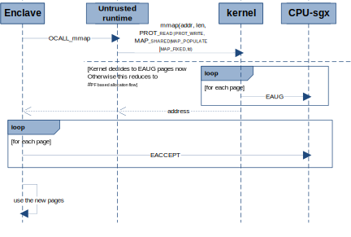
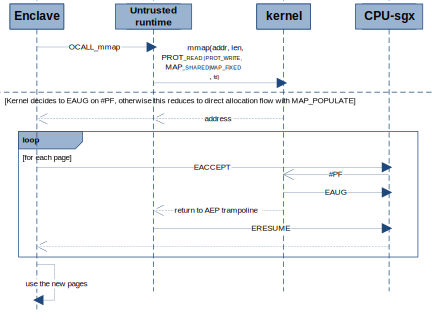
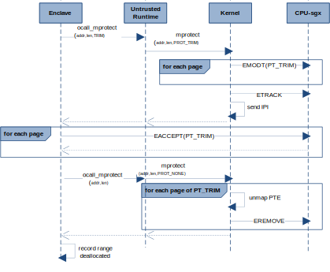
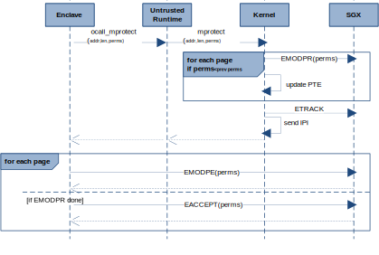
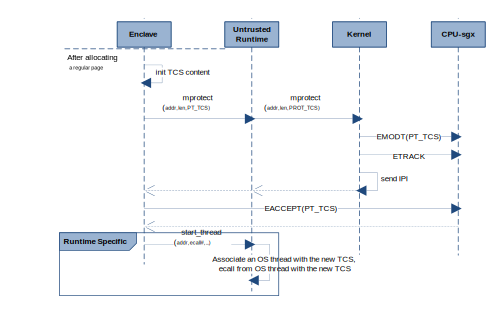
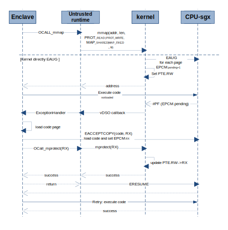
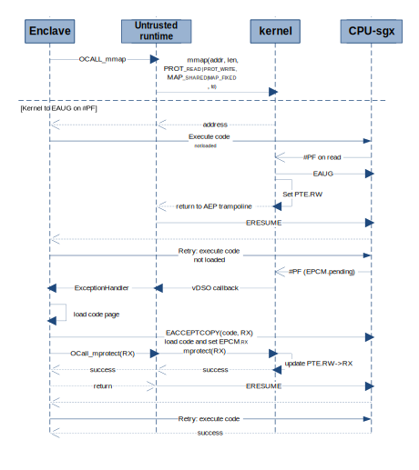

SGX EDMM Linux Driver Interface Design
=====================================

## Motivation

This document describes possible Linux driver interfaces to facilitate discussions among SGX runtime implementors (e.g., https://github.com/openenclave/openenclave/pull/3639) on supporting different SGX EDMM flows.

Although interfaces described here are inspired to be as likely as possible a candidate for future Linux kernel adoption, they are not intended to be a proposal for kernel implementation and are assumed to be implemented as an OOT driver. We hope from discussions enabled by this document, requirements and usage models can be identified to help shape future kernel interfaces. 

Without losing generality, this document may describe how upper layer user space components would use the interfaces. However, details of design and implementation of those components are intentionally left out. The PR mentioned above would provide more contexts on other user space components and their relationships. Further, for those who may want to learn basic principles behind Intel(R) SGX EDMM instructions and how they are typically used, please refer to following references:
- [HASP@ISCA 2016: 11:1-11:9](https://caslab.csl.yale.edu/workshops/hasp2016/HASP16-17.pdf)
- [Intel SDM Vol.4, Ch.36-42](https://software.intel.com/content/www/us/en/develop/articles/intel-sdm.html)

For design and implementation of current SGX1 support in upstream Linux kernel (merged in 5.11RC), please refer to [this patch series](https://lwn.net/Articles/837121/)

## Basic EDMM flows

SGX EDMM instructions support dynamic EPC page allocation/deallocation for enclaves and page property modification post-EINIT.  Following are the basic EDMM flows on which other more advanced usages of EDMM can be built.

**Note:** This document is Linux specific. The term "kernel" and "kernel space" are used in this document when general Linux kernel space actions are described whether implemented in an OOT driver or in kernel tree. Kernel specific implementation details will be explicitly stated as "future kernel" or "kernel patches".  And implementation details such as OCalls issued by enclaves, ETRACK and inter-processor interrupts (IPIs) issued in kernel are generally omitted for brevity.

- Allocate a new page at an address in ELRANGE of an enclave. 
  - This can be an explicit syscall or triggered by a page fault (#PF) when an unavailable page is accessed.
  - Kernel issues EAUG for the page. All new pages should have RW permissions initially.
  - The enclave then issues EACCEPT.
- Deallocate an existing page
  - Enclave signals via a syscall to kernel that a page is no longer in use. 
  - Kernel issues EMODT to change page type to PT_TRIM 
  - The enclave issues EACCEPT
  - Kernel issues EREMOVE on the page at appropriate time
- Change page type, for example, from PT_REG to PT_TCS or PT_TRIM. 
  - Enclave requests via a syscall to kernel to change type of a page from PT_REG to PT_TCS/PT_TRIM
  - Kernel issues EMODT to change page type to PT_TCS/PT_TRIM
  - The enclave issues EACCEPT
- Extend EPCM permissions of a page, e.g., R->RW/RX
  - Enclave issues EMODPE for the page
  - Enclave requests via a syscall that the kernel update the page table permissions to match. 
  - Kernel modifies permissions in PTE 
- Reduce EPCM permissions of a page, e.g. RW/RX->R
  - Enclave requests that the kernel restrict the permissions of an EPC page
  - Kernel performs EMODPR,  updates page tables to match the new EPCM permissions, 
  - Enclave issues EACCEPT
  
**Note:** Flows related to CET support inside enclave will be considered as a future enhancement.

Future kernel may extend mmap and mprotect syscalls to support SGX EDMM usages. But we can't add/change syscall interfaces from an out-of-tree driver.  So, in this proposal for possible driver implementation, we reuse mmap for dynamic enclave memory mapping and expose a new IOCTL, sgx_enclave_mprotect, for enclave page modification. 
 
## mmap

After enclave is initialized (EINIT IOCTL done), the standard Linux mmap syscall can be used to create a new mapping configured for dynamically allocating enclave memory using EAUG. Following comments are specific to SGX EDMM usages, please refer to [mmap man page](https://man7.org/linux/man-pages/man2/mmap.2.html) for generic definitions.  

### Remarks

- To create a mapping for dynamic enclave memory allocation, mmap must be called with an open enclave file descriptor and with PROT_READ | PROT_WRITE for protection flags. 
  - Enclave must issue EACCEPT for the pages after mmap before it can modify the content of the pages and extend/reduce permissions in secure way.
- The offset in mmap parameter must be zero for enclaves.
- MAP_* flags must be MAP_SHARED  | MAP_FIXED masked with optional flags:
    - MAP_POPULATE: hint for kernel to EAUG pages as soon as possible.  
    - MAP_GROWSDOWN: used for stacks.  The mapping will grow down to the next mapping.
- If and only if the address range are within the ELRANGE of the enclave associated with the file descriptor, the mapping will be created. However, user space should not expect EAUG be done by the mmap call.
  - The kernel can choose EAUG pages immediately (likely for MAP_POPULATE), or EAUG pages upon page faults within the VMA, similar to how kernel would allocate regular memory.
- The kernel will assume the newly requested mapping is for dynamic allocation and initial permissions must be RW until user space request changes later. 

**Implementation Notes:** Current [SGX kernel patches](https://patchwork.kernel.org/project/intel-sgx/patch/20201112220135.165028-11-jarkko@kernel.org/) limit PTE permissions to the EPCM permissions given in SEC_INFO during EADD IOCTL calls. The dynamic allocation mappings should not be subject to those limits. A possible implementation may have these changes:
  - sgx_encl_may_map 
    - enforces RW permissions for pages other than those loaded due to EADD or ECREATE.
    - set up flags to track dynamic pages: type, permissions flag
  - sgx_vma_mprotect
    - Allow permissions changes to dynamic pages within limitations of OS policies, e.g.,
	    - never allow WX
	    - SELinux policy specific to SGX enclaves
    - update flags for the dynamic pages

## munmap 
Calling munmap on an enclave page (dynamic allocated or not) has exactly the same effect of calling munmap on a regular RAM page. No sgx specific interface is needed. No behavior changes to current kernel space implementation.

### Remarks

- Enclave memory mapings are shared (MAP_SHARED). The mappings in shared processes are kept alive and independently until the process exits
    - munmap and closing file descriptors are not required for user space. A dead process automatically releases all mappings and file descriptors. 
- Upon all enclave mappings are removed and file handles to the enclave are closed, either by explicit munmap/fclose syscalls or when all hosting apps exited:
    - The kernel may mark its remaining pages are reclaimable and issue EREMOVE on them any time the kernel deems appropriate.

## mprotect IOCTL
This IOCTL emulates the mprotect syscall with SGX specific extensions. In future kernel implementation, it could be mprotect or pkey_mprotect syscall with sgx extensions for the "prot" parameter.

```
#define SGX_IOC_ENCLAVE_MPROTECT _IOW(SGX_MAGIC, 0x06, struct sgx_enclave_mprotect)
/**
 * struct sgx_enclave_mprotect - parameter structure for the
 *                                %SGX_IOC_ENCLAVE_MPROTECT ioctl
 * @addr:	address of the memory to change protections
 * @length:	length of the area.  This must be a multiple of the page size.
 * @prot:	this must be or'ed of following:
             PROT_READ
             PROT_WRITE
             PROT_EXEC
             PROT_TRIM (new): change the page type to PT_TRIM, implies RW. User space should immediately EACCEPT, and then  call mprotect with PROT_NONE.
             PROT_TCS (new): change the page type to PT_TCS
	     PROT_NONE: Signal the kernel EACCEPT is done for PT_TRIM pages. Kernel can EREMOVE the pages at a time it deems appropriate.
 */
struct sgx_enclave_mprotect {
	__u64	addr;
	__u64	length;
	__u64	prot;
};
```

### Remarks

Kernel should ensure that SGX instructions can succeed or catch and handle any fault.
  - The kernel may maintain EPCM information on each page which includes access permission RWX, page types of PT_REG, PT_TRIM, PT_TCS.
  - The kernel should EREMOVE pages of PT_TRIM only after user space signals kernel EACCEPT is done with mprotect(...,PROT_NONE,...). This is because EACCEPT may cause undesired #PF if the target page is already EREMOVED.
  - The kernel catches fault on EMODPR, EMODT and converts to error code returned to user space.

The enclave run-time (or trusted run-time) may implement a parallel memory management structure which would provide information to the enclave on the enclave memory mappings.  The run-time can have a trusted API analogous to mmap which makes a call out of the enclave to issue the mmap  and then either perform EACCEPT on the pages and update the internal memory structures or configure the enclave to perform the EACCEPT when a #PF is delivered to the enclave.  With the outlined kernel interface, either implementation is possible.
## Sequence Diagrams for Basic Flows

### Direct Allocation with MAP_POPULATE



### \#PF Based Allocation



### EPC Deallocation



### Permission Changes



**Notes:**
- EACCEPT is needed for enclave to ensure untrusted runtime and OS indeed invoke EMODPR and EPCM permissions are set as expected.
- It is assumed that both OS and enclave keep track of page permissions. However, it is possible for enclave to avoid that with implementation like this:

```
//Change page permission to perms_target in EPCM without remember previous permissions.
//The tradeoff here is possibly more ocall, emodpr, emodpe, eaccept than necessary.
trusted_mprotect(..., perms_target, ...){
    ocall_mprotect(..., perms_target, ...);   //expect EPCM.perms<=perms_target
    emodpe(..., perms_target, ...);           //expect EPCM.perms>=perms_target
    eaccept(..., perms_target);               //verify EPCM.perms==perms_target
    assert( ZF == 0);
}
```


### TCS Allocation




## Example advanced flows

More advanced flows can be implemented as combinations of the basic flows. Here we present a few examples. 

### Dynamic code loading

To load dynamic code after EINIT, the enclave has to have verify the code to be trustworthy. The mechanism
for an enclave to establish trustworthiness of the new code is out-of-scope of this document.

Assuming a new code page is verified to be trusted and stored at an existing enclave page, then there could
be many ways for an enclave to load the trusted code to a new executable page. For example, in SGX1 environment
without EDMM support, the enclave can reserve RWX regions and load trusted code directly into those regions.
It is straightforward but not flexible or efficient use of EPC. Additionally the requirement of a RWX region
goes against security policies of not running code in writable pages. With EDMM, the EACCEPTCOPY instruction
allows an enclave copy code to a pending page and reset EPCM permissions to RX at the same time, thus provides
a more robust and flexible way to load trusted code without those pitfalls.

Following are two example sequences in which a dynamic code page is loaded using EACCEPTCOPY on demand when
the code page is read for execution at the first time.
 
**Dynamic loading with direct allocation**



**Dynamic loading with #PF based allocation**



In the sequences above it is assumed that the enclave would load a code page only if it is being executed the
first time. This is to minimize the EPC usage.  An enclave could also choose to EACCEPTCOPY to preload the
code ahead of time. In that case, the sequence would be as follows in case of direct allocation.
1. Enclave calls mmap to configure a region in enclave ELRANGE for EAUG
2. Kernel EAUG all pages requested.
3. Enclave EACCEPTCOPYs trusted code from an existing EPC page to the target page, which sets RX permissions in EPCM specified in PageInfo operand.
4. Enclave makes ocall which invokes mprotect syscall to change PTE permissions from RW to RX 

### Lazy dynamic stack expansion
An enclave can lazily expand its stacks as follows.
1. Enclave calls mmap with MAP_GROWSDOWN for a stack region in enclave ELRANGE
2. At some time later, enclave pushes to the top of the stack where no EPC page is populated yet, this results in #PF, causing enclave AEX.
3. Kernel determines faulting address is in a stack region in enclave, EAUGs a page, invokes user space handler via vDSO.
4. The user space handler delivers it into enclave exception handler
5. The enclave exception handler checks the faulting address against its record, determines the fault has happened in a stack area not yet EACCEPT'ed.
6. Enclave issues EACCEPT, returns to untrusted user handler of the hosting process, which returns to kernel fault handler.
7. Kernel fault handler returns to enclave AEX address at which an ERESUME instruction is stored
8. Enclave resumed and the original push instruction is retried and succeeds.

## Exception Handling

This section focuses on changes around \#PF handling which is affected by the new page states (i.e. states in EPCM) introduced by SGX/EDMM, along with the mechanisms for handling exceptions in enclaves. 

An exception or interrupt during enclave execution will trigger an enclave exit, i.e., Asynchronous Enclave Exits (AEX). To protect the secrecy of the enclave, SGX CPU at AEX would save the state of certain registers within enclave memory, specifically, the thread's current State Save Area (SSA). Then it loads those registers with fixed values called synthetic state, of which the RIP (Instruction Pointer Register) is always set to the AEP (Asynchronous Exit Pointer) address. The AEP is passed in as an operand for the EENTER instruction and points to a trampoline code sequence which ualtimately invokes the ERESUME instruction to reenter the enclave.  

As with all non-enclave exception scenarios, the kernel fault handler registered in the Interrupt Descriptor Table (IDT) would be the first in line to handle exceptions for AEX, and it needs to either handle it in kernel space, or if it can't handle, invoke user space exception handler. In both cases, after handlers return, control is tranferred to AEP trampoline, which enventually invokes ERESUME to reenter enclave. 

Current kernel implementation (in release 5.11) can invoke user space exception handler in two ways depending on how EENTER and AEP trampoline are managed:

  1. Direct EENTER in runtime: the user space runtime manages EENTER, AEP trampoline directly and use Linux signal APIs to register and handle exceptions.
  2. vDSO interface: the user space invokes [__vdso_sgx_enter_enclave](https://git.kernel.org/pub/scm/linux/kernel/git/tip/tip.git/tree/arch/x86/include/uapi/asm/sgx.h?h=x86/sgx#n124), passing in a callback for exception handling, and the vDSO implementation manages EENTER and AEP trampoline. 

   The direct EENTER method requires signal handling in runtime library which is known to be challenging in Linux environment. Therefore, the vDSO interface is preferred and assumed in following discussion. (Runtime implementing direct EENTER method would have similar flow but the callbacks from vDSO are replaced with Linux signals.) For more details about the new SGX vDSO interface please refer to documentation in the [kernel header file](https://git.kernel.org/pub/scm/linux/kernel/git/tip/tip.git/tree/arch/x86/include/uapi/asm/sgx.h?h=x86/sgx#n124). General sequence is as follows:

  1. User space initializes an sgx_enclave_run struct, run = {..., TCS, sgx_enclave_user_handler, ...}
  2. User space calls __vdso_sgx_enter_enclave (..., EENTER, run, ...)
  3. vDSO invokes EENTER (TCS, vDSO AEP) to enter the enclave, the vDSO AEP points to an ERESUME instruction in vDSO code.
  4. If the enclave finishes sucessfully, and EEXITs, the vDSO sets run.function = EEXIT, goto step 7.
  5. In an event of AEX, the kernel handles the fault if possible, e.g. EAUG on #PF, returns to vDSO AEP.
  6. Otherwise, the kernel dispatches the fault to vDSO (via an entry in exception fix-up table), which copies exception info to run.exception_vector, run.exception_error_code, run.exception_addr, last seen ENCLU leaf in RAX (ERESUME) to run.function
  7. vDSO invokes sgx_enclave_user_handler(..., run)
  8. The sgx_enclave_user_handler process enclave exit event:
      * If run.function == EENTER, error case, return negative to fail the last  __vdso_sgx_enter_enclave call. User space should treat as if enclave loses EPC context due to power envents or other causes assuming no bugs in code, and try to reload the enclave.
      * If run.function == EEXIT, return 0 for normal enclave ecall return, return EENTER after invoking proper ocall with runtime specific convention.
      * If run.function == ERESUME, invokes  calls __vdso_sgx_enter_enclave (..., EENTER, run2, ...) to handle exception inside enclave, then return ERESUME.
  9. The vDSO returns to caller if the user handler's return is not EENTER or ERESUME, otherwise use ERESUME or EENTER accordingly to reenter the enclave.


### Fault Handling in Kernel

SGX enclave execution may cause “EPCM Induced #PF”. For those #PFs, SGX enabled CPUs set the SGX bit (bit 15) in Page Fault Error Code (PFEC). It is always generated in the PFEC register if the fault is due to an EPCM attribute mismatch. The kernel #PF handler will only see the faulting address (via CR3) and the PFEC codes on a page fault.  It must rely on this information and its own stored information about the address of the fault (VMA and PTE) to make a decision on how to handle the fault.  In many cases, the kernel can only issue a signal or call user handler callback registered in the SGX vDSO function with run.function=ERESUME and pass on all relevant exception info.  

In addition, a running enclave can lose EPC context due to power events (S3/S4 transitions) or VM being suspended. A page fault on EENTER instruction (either at an initial ecall or at re-entering enclave for exception handling) results in those cases, and the user handler would receive a callback from vDSO with run.function = EENTER. 

This table summarizes kernel, vDSO, user handler actions in different fault scenarios related to enclave operations. All exceptions considered here happen inside enclave causing AEX, or at EENTER/ERESUME, so the kernel will convert them to the synchronous callbacks thru vDSO interface as needed. 

| Fault Condition  | Key #PF PFEC Contents  | Kernel/vDSO Action  | Untrusted User Handler | 
|---|---|---|---|
| Access a page which has been swapped out | #PF where PFEC.P=0   |  ELD the page from backing store, ERSUME | N/A |
| Access Page Mapped PROT_NONE<br>(page that the enclave has not mmap'ed)  | #PF where PFEC.P=0   |  invoke user handler<br>(run.fun=ERESUME) | invoke enclave handler |
| Access Page Mapped PROT_W (Page had been mmap'ed by enclave, but not EAUG'ed)  | #PF where PFEC.P=0   | EAUG and map the page then ERESUME | N/A |
| Page Protection mismatch in PTE| #PF where PFEC.W/R or PFEC.I/D will not match PTE  |  invoke user handler<br>(run.fun=ERESUME) | invoke enclave handler | 
| Page Protection mismatch in EPCM| #PF where PFEC.SGX=1  | invoke user handler<br>(run.fun=ERESUME) | invoke enclave handler | 
| Access Page with EPCM.Pending  | #PF where PFEC.SGX=1   | invoke user handler<br>(run.fun=ERESUME) | invoke enclave handler | 
| Access Page with EPCM.Modified | #PF where PFEC.SGX=1   | invoke user handler<br>(run.fun=ERESUME) | invoke enclave handler |
| Access Page with type PT_TRIM  | #PF where PFEC.SGX=1  | invoke user handler<br>(run.fun=ERESUME) | invoke enclave handler |
| EENTER with invalid TCS <br>(EPC loss due to power events or VM suspend/resume) | #PF where PFEC.SGX=1 or PFEC.P = 0 | invoke user handler<br> (run.fun=EENTER) | return error to app signaling enclave lost<br>App should reload enclave |
| ERESUME with invalid TCS <br>(EPC loss due to power events or VM suspend/resume) | #PF where PFEC.SGX=1 or PFEC.P = 0 | invoke user handler<br> (run.fun=ERESUME) | invoke enclave handler <br> and will trigger #PF on EENTER | 

**Note:**  When an error/exception happens when kernel handles a fault on behalf of an enclave, the kernel sees the original fault happened at AEP and would fix it up as a callback to user handler with run.function = ERESUME. For example, in the first case of the table above, a fault on ELD (EPC loss caused by power events) would be fixed up in this way.

# Enclave Handling of Faults

Once an exception is passed into an enclave, the enclave has to rely on trusted info stored in the active SSA by CPU during AEX to make right decisions in handling the exception. It should not rely on any info passed in from the untrusted side. To gain access to fault related info in SSA, an enclave configured to use SGX2 EDMM features should also configure the SECS.MISCSELECT to report EXIINFO in the State Save Area frame on a #PF or a General Protection (#GP) Fault. This will ensure that the enclave has the following information in the SSA frame on a #PF:
* ExitInfo.Vector = #PF identifies that a #PF caused an asynchronous exit
* MISC.EXINFO.MADDR = the linear address that page faulted (analogous to CR2)
* MISC.EXINFO.ERRCD = Page-Fault Error Code - information about the page fault

To securely handle all faulting scenarios and EDMM flows, in addition to information stored in SSA, the enclave should store information about its own memory configuration and relevant states.  This can be an array or table of structures storing information about each mapped region of enclave memory.  The information that the enclave should store includes:
* Address Range: Range of Enclave Linear Addresses that are covered by the region
* Permissions: Combination of Read, Write, Execute
* Page Type: SGX page type of pages in the region - PT_TCS, PT_REG, or PT_TRIM
* State: the state of the region.  The state may indicate that the region is in transition.  For example is is changing page type or permissions.  
* Table of information about the EACCEPT state of each page in the region.  This may be a temporary structure which keeps track of pages which are EACCEPTed for operations requiring EACCEPT.  This can ensure that the enclave does not EACCEPT a page twice.  For example, when a page is EAUG'ed to an enclave linear address, the enclave should only EACCEPT that page once.  If the enclave could be convinced to EACCEPT the page twice, then the OS can potentially EAUG two pages at the same enclave linear address and freely swap them by modifying PTEs.

Enclaves should prevent two threads from simultaneously operating on the same region, e.g, trying to EMODPE on a page while permission change is in progress in another thread.  One way to ensure this is to use some lock/synchronization mechanism to protect the state of each region, have the second thread wait if page is in transition state. 

When an enclave is called after faulting, the enclave can consult its stored memory region states and the ExitInfo.Vector and MISC.EXINFO in SSA to determine what to do with the fault.  The following table lists actions on specific page faults.

| EXITINFO/MISC.EXINFO<br>Information | State of Region | Cause of Fault | Enclave Action   |
|---|---|---|---|
| ERRCD(PFEC).P=0   | n/a | Enclave has accessed an unallocated memory region|Call exception handlers, abort if not handled |
| ERRCD(PFEC).W/R or I/D does not match protections | Not In-Transition | Enclave has incorrectly accessed memory region|Call exception handlers, abort if not handled |
| ERRCD(PFEC).W/R or I/D does not match protections | In-Transition | Enclave has incorrectly accessed memory region which may be changing protections|If future protections will allow access then pend on Lock/Mutex for region, else call exception handlers, abort if not handled |
| ERRCD(PFEC).SGX=1  | Not In-Transition | Error in run-time or kernel | Depending on run-time design, the enclave should not encounter this. |
| ERRCD(PFEC).SGX=1  | In-Transition | Page is being accessed during transition | If future protections/page-type will allow access then pend on Lock/Mutex for region, else call exception handlers, abort if not handled |

## Debugger Support

The EDMM flows do not affect how debugger read/write enclave memory by EDBGRD/EDBGWR.  However, the DBGOPTIN (i.e. bit 0) of TCS.FLAGS must be set to enable hardware breakpoints and allow single-stepping inside the enclave thread entered with that TCS. Therefore, for TCS pages added dynamically using EDMM instructions, debuggers are required to trap TCS creation flow in order to set DBGOPTIN. For GDB on Linux, the debugger scripts can collaborate with runtime to set DBGOPTIN. One possible implementation could be described as below.
- Whenever a new TCS page is ready to use, the runtime invokes a special empty function and passes the TCS address as its argument.
- GDB startup script sets a breakpoint on that empty function to receive the debug interrupt.
- Once the breakpoint has been hit, GDB script extracts the address of the TCS page, and sets DBGOPTIN for that TCS.
- GDB resumes the interrupted application.
- From now on, hardware breakpoints and single stepping are allowed inside enclave threads  entered with the newly created TCS

For Windows, similar collaboration between debugger and runtime can be implemented using exceptions instead of breakpoints on empty functions.

For runtimes using EDDM to load dynamic modules into enclave after EINIT, the runtime needs to signal module loading events to the debugger so that the debugger can load additional symbols for those modules. That can also be implemented using exceptions or pre-defined breakpoints.

**Note:** Kernel does not fixup Debug Exceptions (#DB) and Breakpoints (#BP). 
